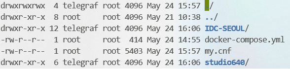
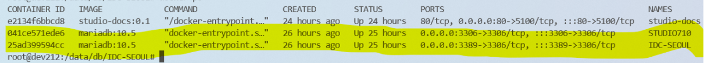

# 2. 배포

## 배포

&#x20;**1. 배포 할 서버 접속**

* Repository.tar IDC-SEOUL.tar studio640.tar 모두 /tmp로 붙여넣기

&#x20;**2.  이동 --> cd /data**

&#x20;**3. 파일 옮기기**

> $mv /tmp/repository.tar ./
>
> $mkdir db&#x20;
>
> $cd db&#x20;
>
> $mv /tmp/IDC-SEOUL.tar studio640.tar ./
>
> $tar -vxf IDC-SEOUL.tar
>
> $tar -vxf studio640.tar

* 위 커맨드로 압출을 풀면 다음과 같이 폴더가 생성된다.

&#x20;

**4. 압축 푼 데이터에 도커물리기(mount)**

> $ cd /data/db/IDC-SEOUL
>
> $ docker-compose up -d
>
> $ cd /data/db/studio640
>
> $ docker-compose up -d
>
> $ docker ps&#x20;

