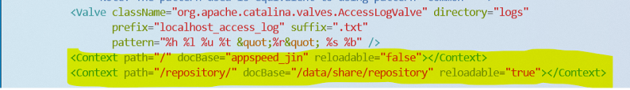

# 4. 톰캣설치 및 설정

## 톰캣설치 및 설정


&#x20;**1. 설치**

```
$ sudo apt-get install tomcat9
```

&#x20;**2. 데몬즉시반영**

```
$ sudo systemctl daemon-reload
```

&#x20;**3. 설치 확인**

```
$ ps aux | grep tomcat
```

&#x20;**4. 재부팅**

```
$ reboot
```

&#x20;**5. Server.xml 설정**

```
$ cd /var/lib/tomcat9/conf
$ vi server.xml 
```

* 다음 내용을 추가하거나 수정한다.

```
<Connector port="8080" protocol="HTTP/1.1" connectionTimeout="20000" redirectPort="8443" URIEncoding="UTF-8" />
<Context path="/" docBase="appspeed_jin" reloadable="false"></Context>
<Context path="/repository/" docBase="/data/share/repository" reloadable="true"></Context>
```



&#x20;**6. 첨부파일 보안 설정**

> $ cd /lib/system/system
>
> $ vi tomcat9.service

* 아래의 내용을 추가한다.

> \#Security
>
> ReadWritePaths=/data/share/repository/

* &#x20;alias 설정(선택)&#x20;

단축키 개념이다. 간단한 커맨드로 시간을 줄일 수 있으니 설정하도록 하자.

이동 : cd /root

파일 : vi .bashrc

내용 :   alias tlog='tail -f /var/lib/tomcat9/logs/appspeed\_default.log'

&#x20;           alias t\_log='cd /var/lib/tomcat9/logs'

&#x20;           alias t\_conf='cd /var/lib/tomcat9/conf'

&#x20;           alias t\_webapps='cd /var/lib/tomcat9/webapps'

&#x20;           alias tstatus='sudo systemctl status tomcat9'

&#x20;           alias trestart='sudo systemctl restart tomcat9'

&#x20;           alias tstart='sudo systemctl start tomcat9'

&#x20;           alias tstop='sudo systemctl stop tomcat9'

&#x20;$ reboot
