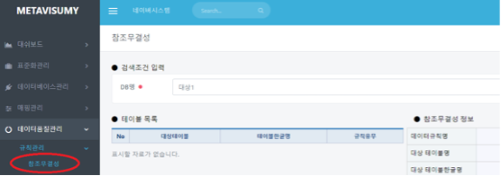
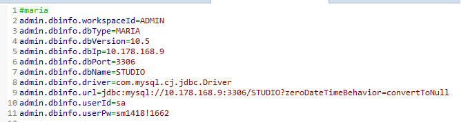
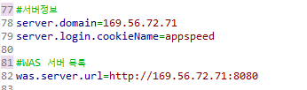
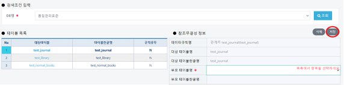
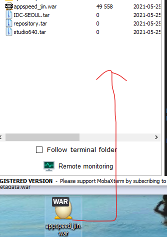

# 5. 파일 배포(war파일 만들기)

## 파일 배포(war파일 만들기)


&#x20;**1. common.properties 수정**&#x20;

* 새로운 common.jin.properties 파일을 만듭니다.



&#x20;****&#x20;

**2. db정보, 서버 정보 setting**

* 오픈 할 서버 정보와 db정보를 입력한다.
* cf) was서버 목록은 LB셋팅이 되어 있으면 개수만큼 ',' 구분자를 넣어 모두 입력.





&#x20;****&#x20;

**3. pom.xml 수정**

* profile 추가 : 비슷한 profile 복사 후 id, finalName, copy 항목 배포명 변경            &#x20;

표시된 부분. 이름 통일 시켜줄 것 filename:\_jin = common.jin.properties



&#x20;****&#x20;

**4. dependency 추가**

```
<dependency>
<groupId>javax.xml.bind</groupId>
<artifactId>jaxb-api</artifactId>
<version>2.3.0-b170201.1204</version>
</dependency>
```

&#x20;

**5. maven build 파일 생성**

* appspeed 프로젝트 선택 > 우클릭 > Run As > Run Configurations
* 우측 목록에서 Maven Build 아래에 있는 항목중 하나를 선택해서 Duplicate
* 이름 변경후 좌측 Main 텝의 Goals를 \[clean install -P 서버구분 -X]으로 수정후 Apply
* Run 실행(최초한번만 위의 3개 항목을 실행하고 다음부터는 Run만 실행)


&#x20;****&#x20;

**6. war파일 복사**

* appspeed 프로젝트 > target > appspeed\_\[서버구분].war 파일을 바탕화면에 복사

> $ cd /var/lib/tomcat9/webapps

* 해당위치에 war 파일(appspeed\_jin.war) 복사



&#x20;

**7. 서버에 배포**

* 이동 : t\_webapps
* 서버정지 : tstop
* 기존파일 삭제 : rm -r \*
* 파일반영 : mv /\[war파일경로]/appspeed\_\[서버구분].war
* 서버시작 : tstart
* 로그확인 : tlog


