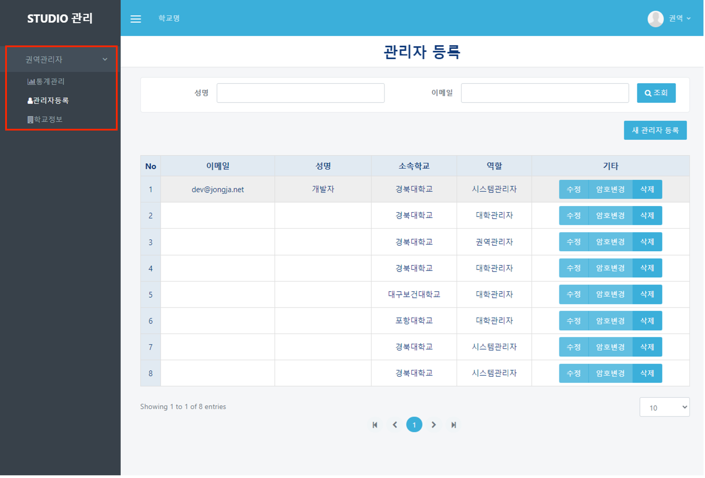
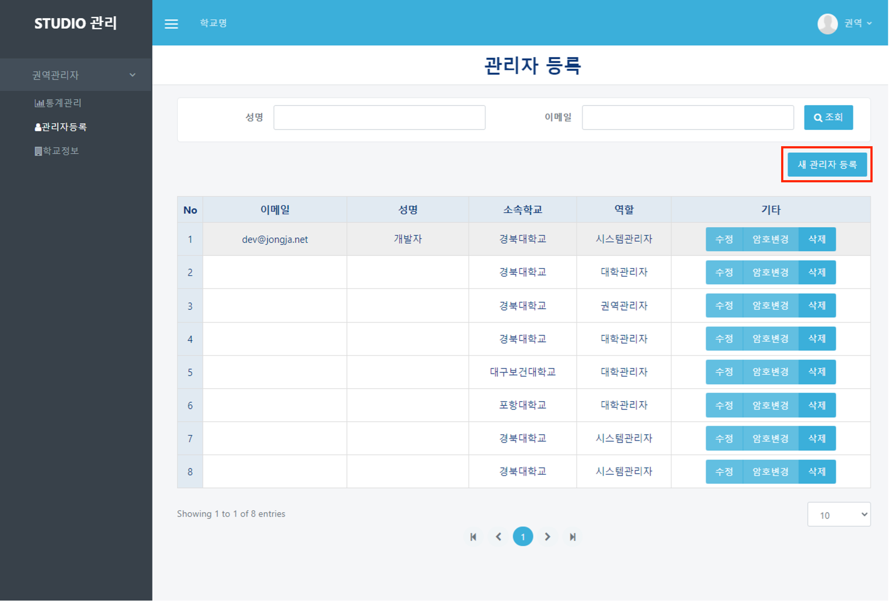
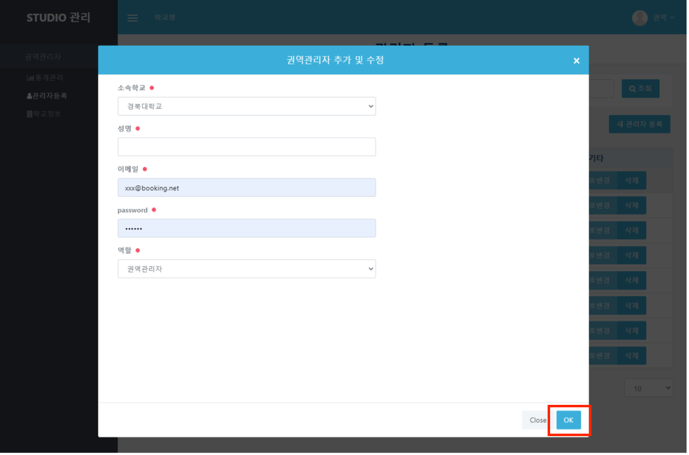
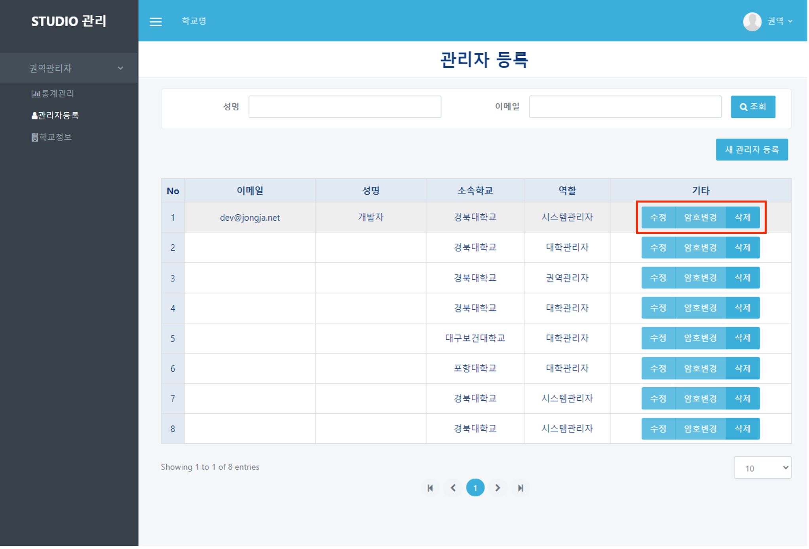

# 관리자 등록

## 관리자등록

#### ❶  appspeed내의 booking 페이지([https://dgstudio.udec.kr/apps/booking](https://dgstudio.udec.kr/apps/booking))에 접속합니다.

#### ❷ 나타난 로그인 창에 초기설정으로 발급된 아이디와 비밀번호를 입력하고 로그인합니다.

#### ❸ 좌측의 `관리자등록` 메뉴를 클릭합니다.

#### ❹ 표 우측 상단에 있는 `새 관리자 등록` 버튼을 클릭합니다.

#### ❺ 해당 버튼을 클릭하면 나오는 모달 창에 항목을 모두 입력하고 `OK` 버튼을 누릅니다.

#### ❻ 관리자를 수정, 암호변경, 삭제를 원하는 경우 기타 항목에 있는 `수정`, `암호변경`, `삭제` 버튼을 선택해서 작업합니다.

