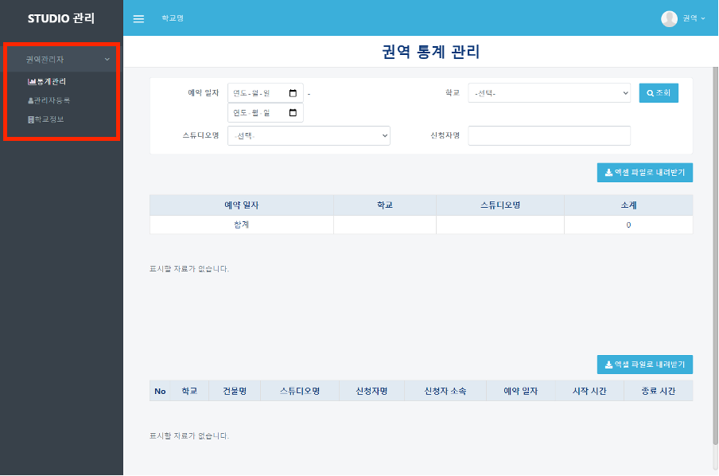
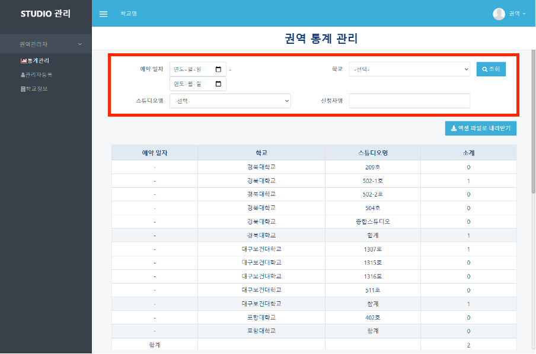
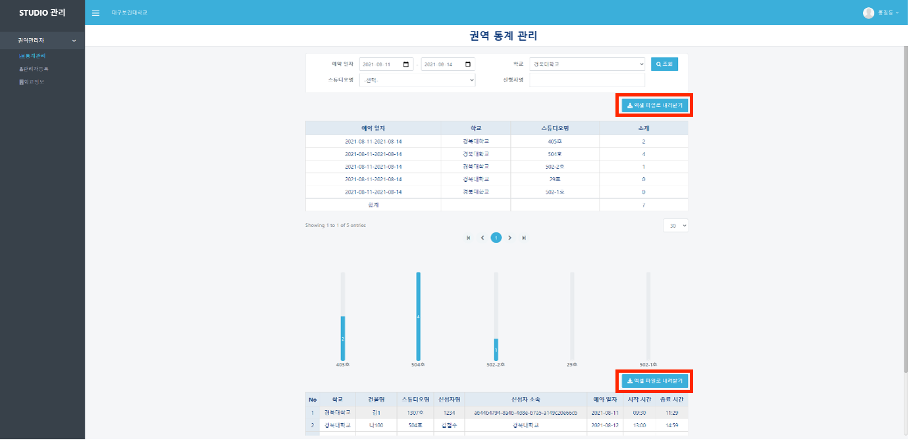

# 통계 관리

## 통계관리

#### ❶  appspeed내의 booking 페이지([https://dgstudio.udec.kr/apps/booking](https://dgstudio.udec.kr/apps/booking))에 접속합니다.

#### ❷ 나타난 로그인 창에 초기설정으로 발급된 아이디와 비밀번호를 입력하고 로그인합니다.

#### ❸ 좌측의 `통계관리` 메뉴를 클릭합니다.

#### ❹ 우측에 검색하고 싶은 조건을 입력하고 `조회` 버튼을 클릭합니다. 이때, 조건을 입력하지 않고 조회를 누르면 모든 데이터가 나옵니다.

#### ❺ 원하는 데이터를 필터링하면 상단에는 소계를 보여주는 테이블, 하단에는 개별 데이터를 보여주는 테이블이 나오게 됩니다.&#x20;

#### 엑셀 파일로 보기를 원하는 테이블 위의 `엑셀 파일로 내려받기` 버튼을 클릭하면 엑셀 파일로 자료를 다운로드받을 수 있습니다.

