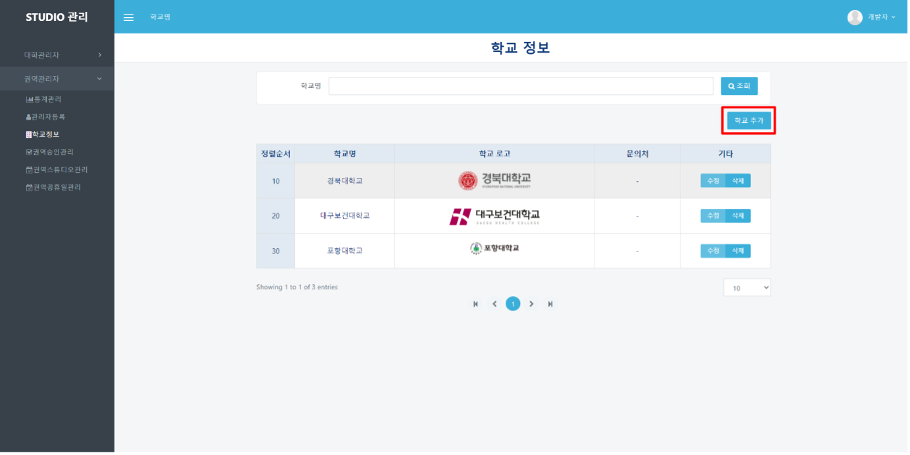

# 학교 정보

## 학교정보

#### ❶  appspeed내의 booking 페이지([https://dgstudio.udec.kr/apps/booking](https://dgstudio.udec.kr/apps/booking))에 접속합니다.

#### ❷ 나타난 로그인 창에 초기설정으로 발급된 아이디와 비밀번호를 입력하고 로그인합니다.

#### ❸ 좌측의 `학교정보` 메뉴를 클릭합니다.

####

#### ❹ 표 우측 상단의 `학교 추가` 버튼을 클릭합니다.

❺ **학교명, 학교로고, 정렬 순서(사용자가 사용하는 예약사이트의 로고 순서에 반영), 문의처를 입력하고 `OK`클릭합니다.**

#### ❻ 학교 정보 수정, 삭제를 원하는 경우 기타 항목에 있는 `수정`, `삭제` 버튼을 선택해서 작업합니다.

