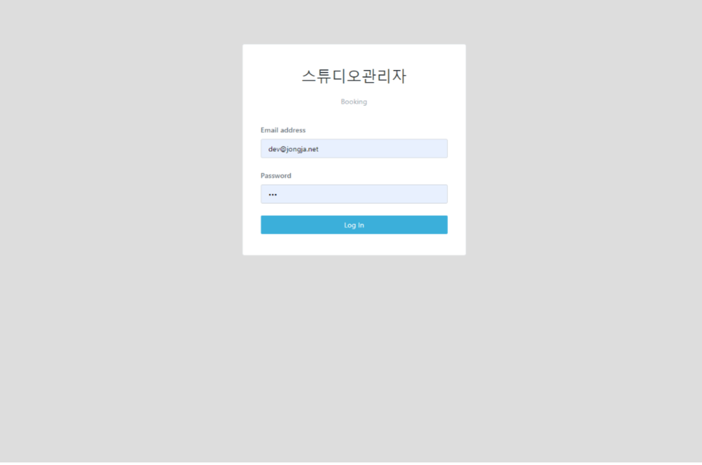
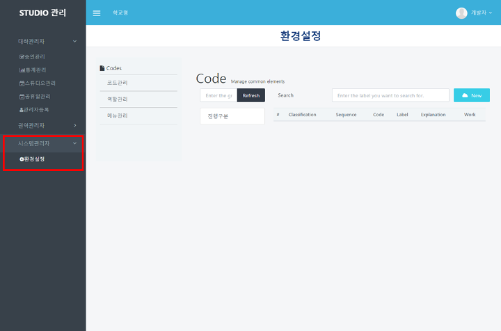
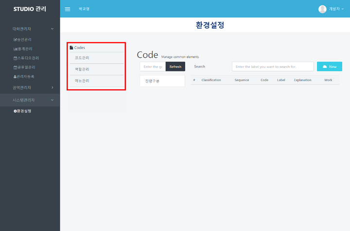

# 시스템관리자 매뉴얼

## 환경설정

#### ❶  appspeed내의 booking 페이지([https://dgstudio.udec.kr/apps/booking](https://dgstudio.udec.kr/apps/booking))에 접속합니다.

#### ❷ 나타난 로그인 창에 초기설정으로 발급된 아이디와 비밀번호를 입력하고 로그인합니다.

#### ❸ 좌측 하단의 `환경설정`을 클릭합니다.

#### ❹ 내부의 `코드 관리` , `역할관리`, `메뉴관리를` 활용해 전체 환경설정을 할 수 있습니다.

### 코드 관리 - config

**Code가 max\_length로 지정되어 있는 내용의 Label (CODE\_NAME)을 변경하면 대학관리자-공지사항 게시판의 공지사항 최대 글자수를 변경할 수 있습니다.**

.png>)

