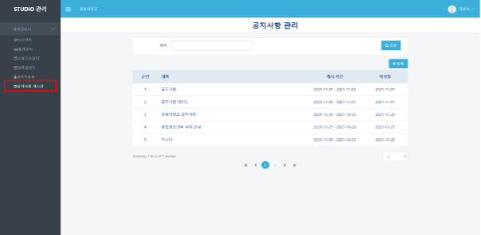
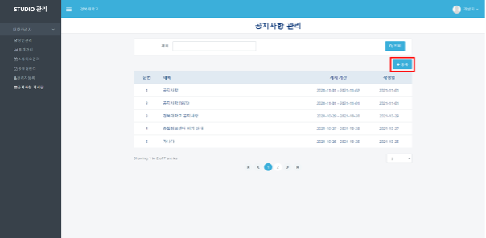
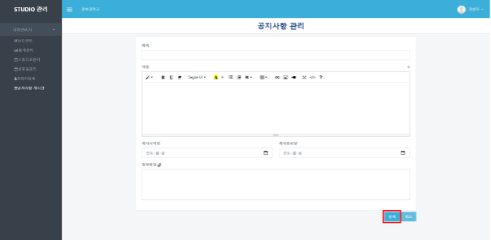
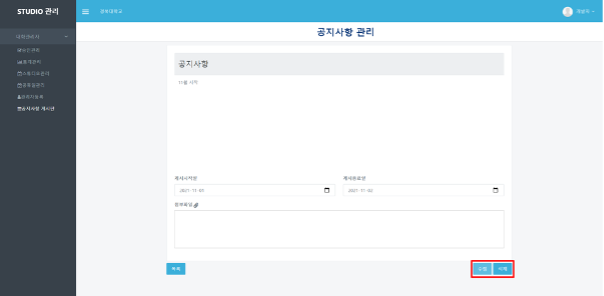
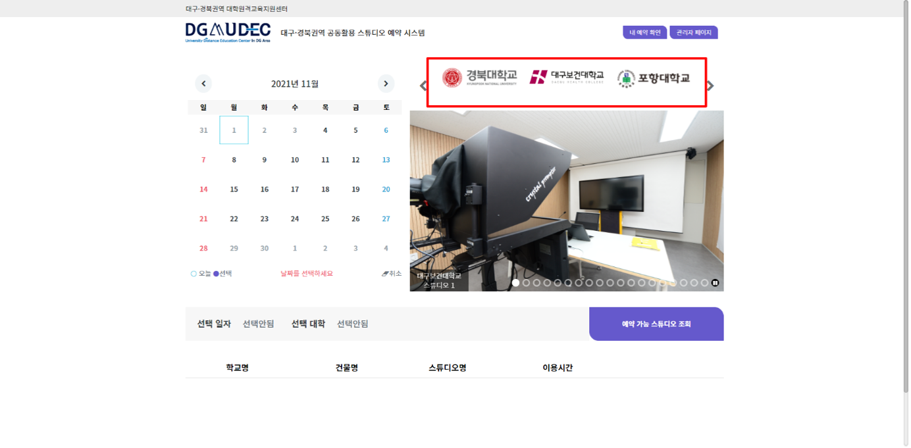
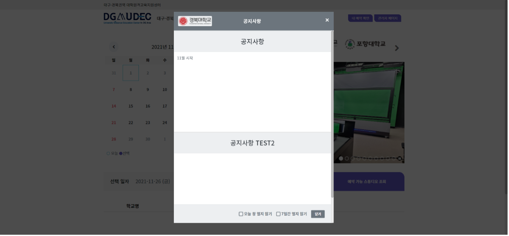

# 공지사항 게시판

### **공지사항 게시판**

****

**❶ appspeed내의 booking 페이지(**[**https://dgstudio.udec.kr/apps/booking**](https://dgstudio.udec.kr/apps/booking)**) 에 로그인하여 접속합니다.**

**❷ 좌측의 `공지사항 게시판` 메뉴를 클릭 합니다.**

**❸ `등록` 버튼을 클릭해 공지사항의 제목, 내용, 게시 기간을 설정할 수 있습니다. 첨부파일의 경우 최대 1개까지 등록할 수 있습니다. 작성 후 `등록` 버튼을 클릭하여 공지사항 게시가 가능합니다**

**❹ 게시판 목록에서 원하는 글을 선택하여 내용을 확인할 수 있으며 `수정` 버튼을 통해 내용을 수정하고 `삭제` 버튼을 통해 글을 삭제할 수 있습니다.**

**❺ 게시한 공지사항은 예약 시스템 홈페이지에서 공지사항을 게시한 해당 대학교를 선택 클릭 했을 때 팝업으로 확인할 수 있습니다.**

****
