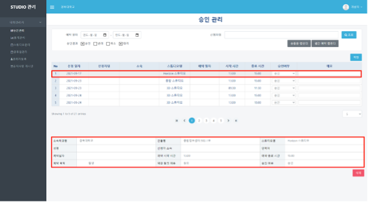
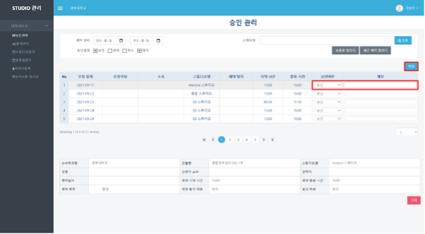
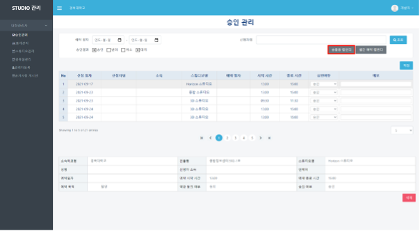
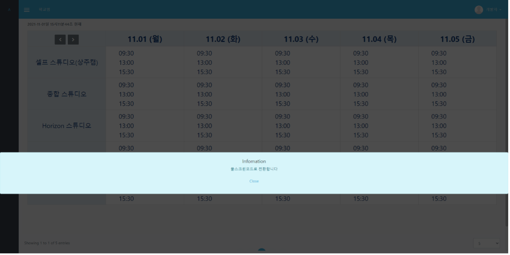
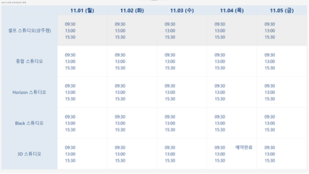
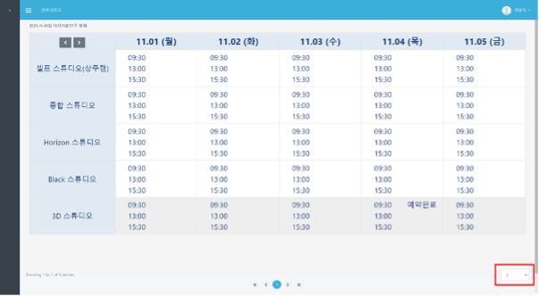
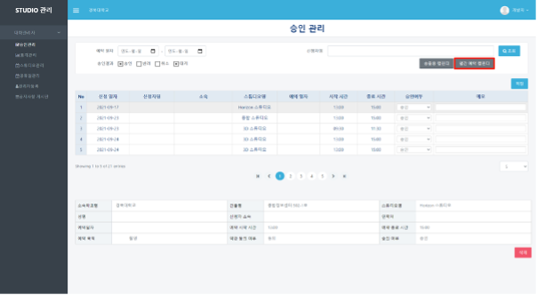
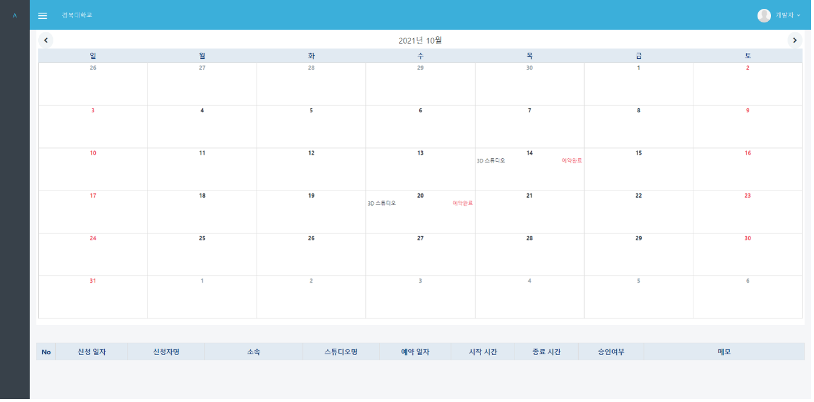
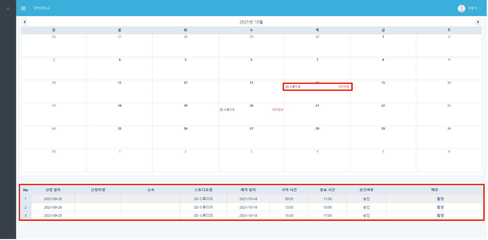

# 승인 관리

### 승인관리

#### ❶  appspeed내의 booking 페이지 ([https://dgstudio.udec.kr/apps/booking](https://dgstudio.udec.kr/apps/booking))에 로그인하여 접속합니.

#### ❷ 좌측의`승인관리` 메뉴를 클릭합니다. 처음 들어왔을 때 보이는 자료는 `승인`,`대기` 상태의 신청들입니다.

#### ❸ 상단 표 내부의 요약된 데이터를 선택하면 하단에 더 자세한 신청 내역을 볼 수 있습니다.

#### ❹ 신청 내역을 보고 승인/반려/취소 여부를 선택하고, 필요에 따라 메모를 기입한 후 표 우측 상단의 `저장` 버튼을 클릭합니다.

#### ❺ 대기 상태가 아닌 승인/반려/취소 상태의 접수 건을 보거나 예약 일자, 신청자명으로 검색하기를 원하는 경우, 상단에 검색 조건을 넣고 조회를 클릭합니다.

### 송출용 캘린더

**❶ 승인 관리 페이지에서 `송출용 캘린더` 버튼을 누르면 예약 현황을 송출하기 위한 주간 캘린더 창이 뜹니다. 시작하면 바로 풀스크린 모드로 전환됩니다.**

**❷ `Esc` 키를 누르면 풀스크린 모드가 종료됩니다.**&#x20;

**종료 이후 송출용 캘린더 화면에서는 한 화면에 몇 개의 스튜디오를 표시할 것인지 설정할 수 있습니다. 한 페이지의 최소 스튜디오 개수는 5개, 최대 개수는 10개입니다.**

### 월간 예약 캘린더

**❶ 승인 관리 페이지에서 `월간 예약 캘린더` 버튼을 누르면 일자별로 예약이 모두 찬 스튜디오의 정보가 뜹니다.**

**❷ 예약이 완료된 스튜디오를 클릭하면 해당 날짜의 선택한 스튜디오 예약 정보를 확인할 수 있습니다.**

