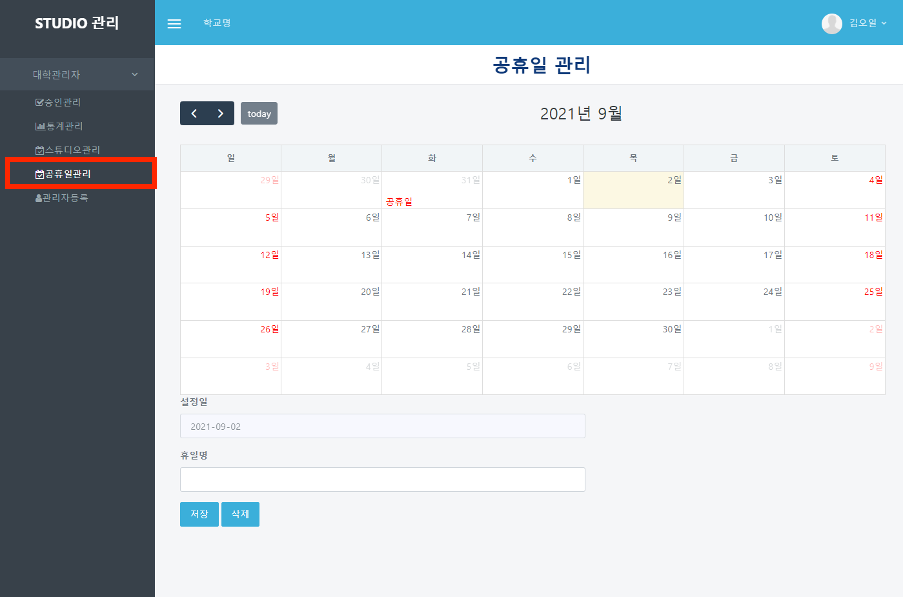
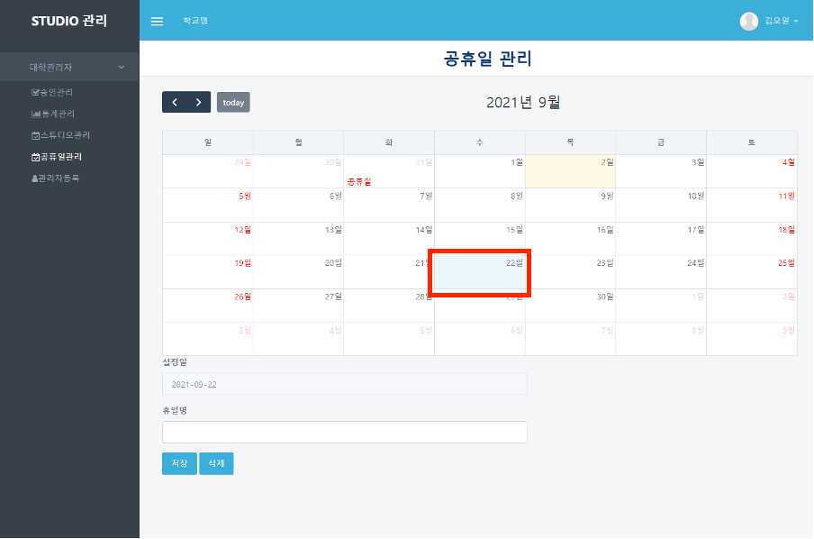
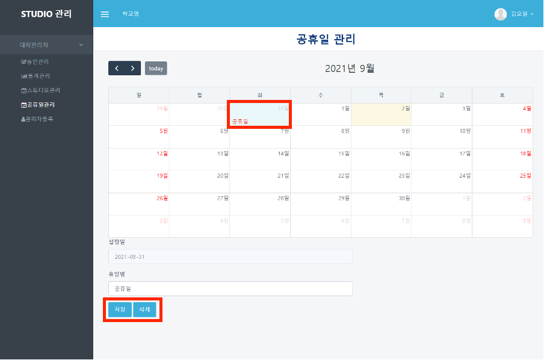

# 공휴일 관리

## 공휴일 관리

#### ❶  appspeed내의 booking 페이지([https://dgstudio.udec.kr/apps/booking](https://dgstudio.udec.kr/apps/booking))에 로그인하여 접속합니다.

#### ❷ 좌측의 `공휴일관리` 메뉴를 클릭합니다.

#### ❸ 관리자가 속한 학교의 공휴일로 추가하기를 원하는 날짜를 선택합니다.

#### ❹ 휴일명을 적고 `저장`을 클릭하면 해당 날짜가 휴일로 예약사이트에 반영됩니다.

#### ❺ 휴일 정보를 삭제하기를 원하는 경우, 해당 날짜를 클릭하고 `삭제` 버튼을 클릭합니다.

