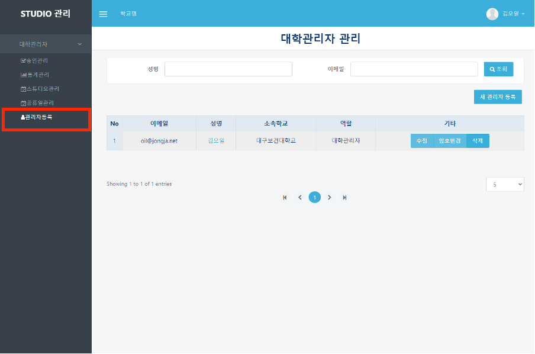
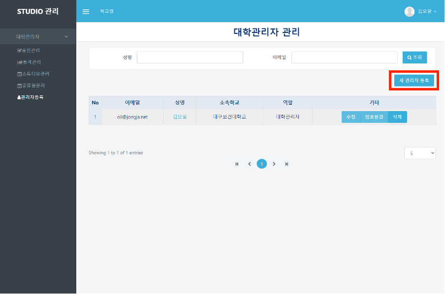
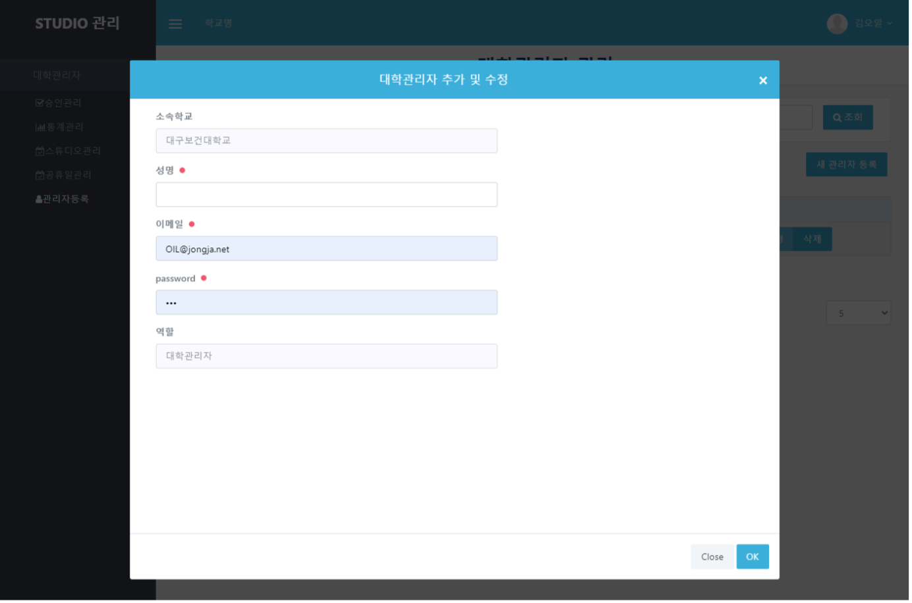
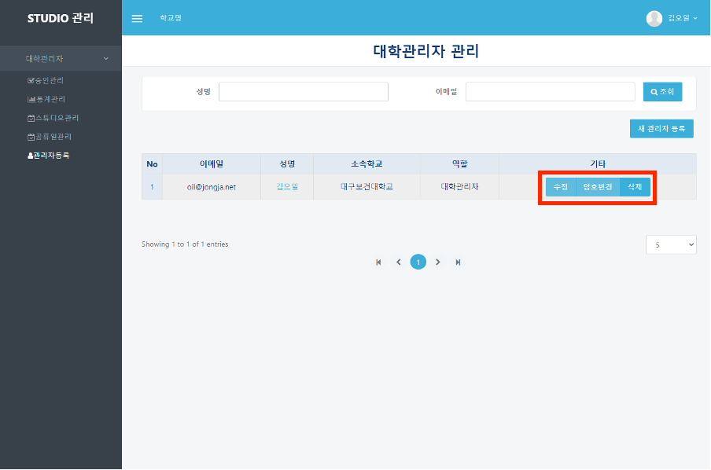

# 관리자 등록

## 관리자 등록

#### ❶  appspeed내의 booking 페이지([https://dgstudio.udec.kr/apps/booking](https://dgstudio.udec.kr/apps/booking))에 로그인하여 접속합니다.

#### ❷ 좌측의 `관리자등록` 메뉴를 클릭합니다.

#### ❸ 관리자 등록을 위해서 표 우측 상단의 `새 관리자 등록` 버튼을 클릭합니다.

#### ❹ 클릭하면 나타나는 모달 창에 정보를 모두 입력한 뒤 `OK` 버튼을 클릭합니다.

#### ❺ 관리자를 수정, 암호변경, 삭제를 원하는 경우 기타 항목에 있는 `수정`, `암호변경`, `삭제` 버튼을 선택해서 작업합니다.

