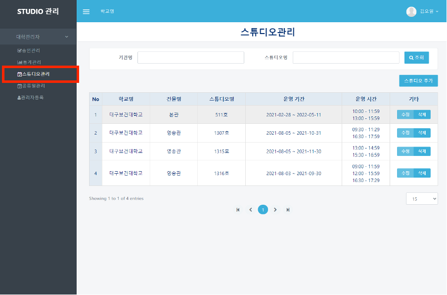
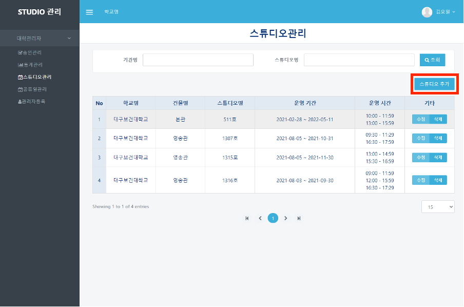
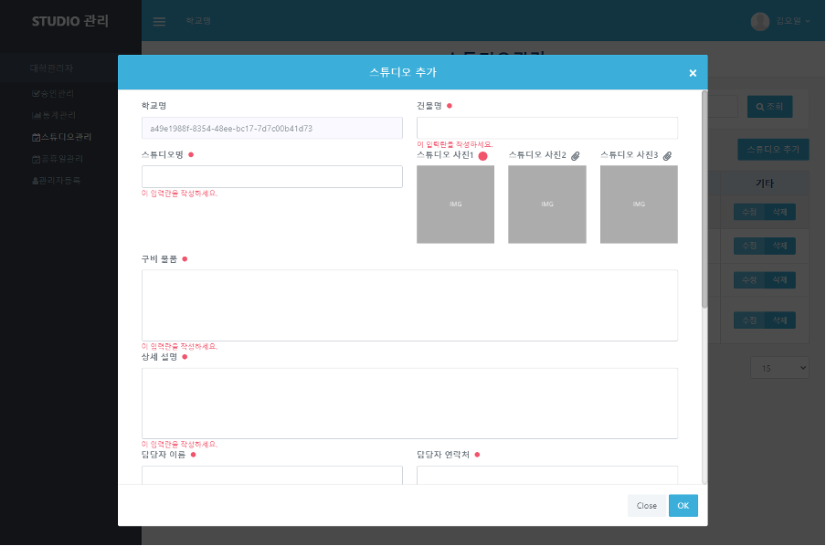
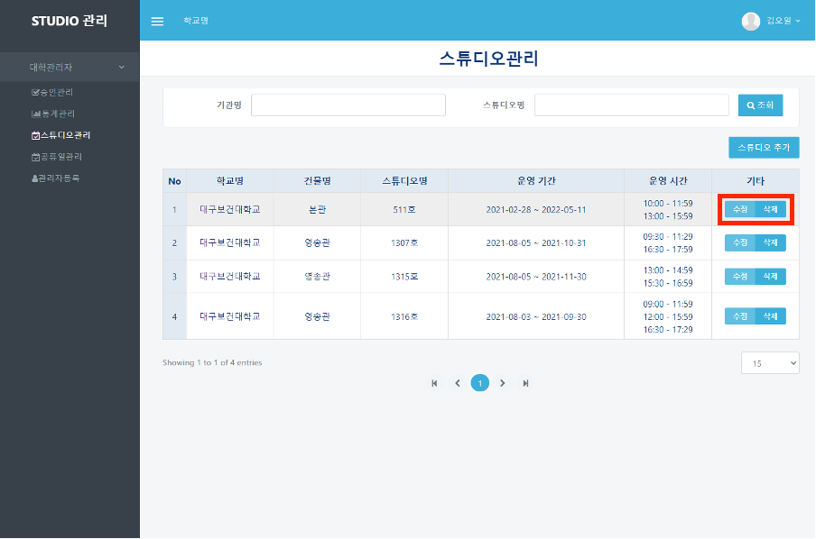

# 스튜디오 관리

## 스튜디오 관리

#### ❶  appspeed내의 booking 페이지([https://dgstudio.udec.kr/apps/booking](https://dgstudio.udec.kr/apps/booking))에 로그인하여 접속합니다.

#### ❷ 좌측의 `스튜디오관리` 메뉴를 클릭합니다.

#### ❸ 스튜디오 추가를 위해서 표 우측 상단에 있는 `스튜디오 추가` 버튼을 클릭합니다.

#### ❹ 나타난 모달 창에 입력이 필요한 항목을 모두 입력한 후 `OK` 버튼을 클릭합니다.

#### ❺ 스튜디오 정보를 수정, 삭제하기를 원하는 경우, `수정`이나 `삭제`버튼을 클릭합니다.

