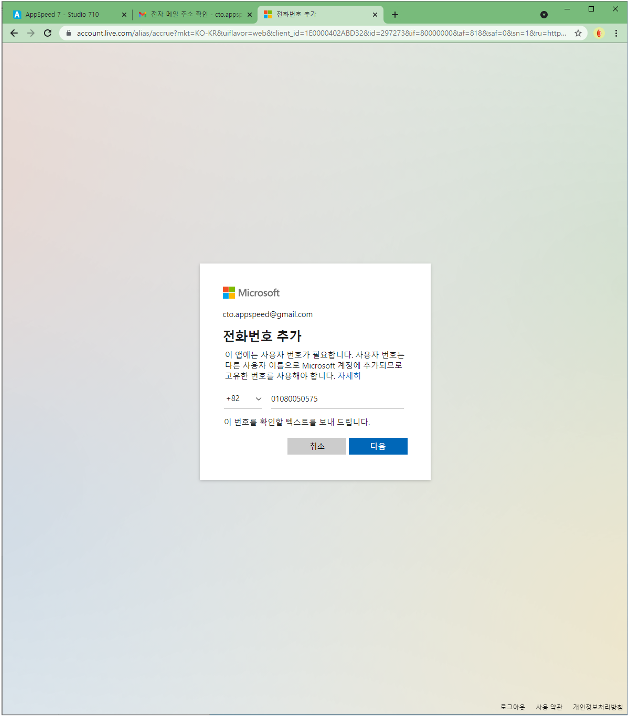
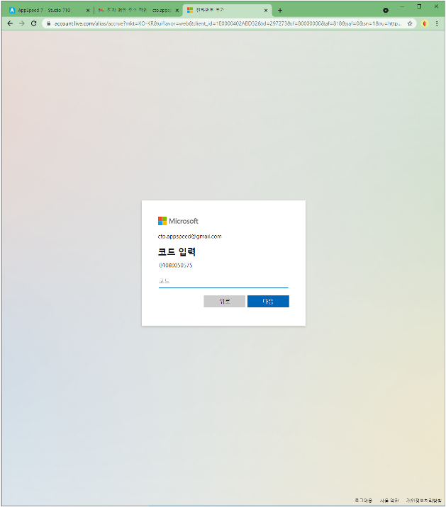
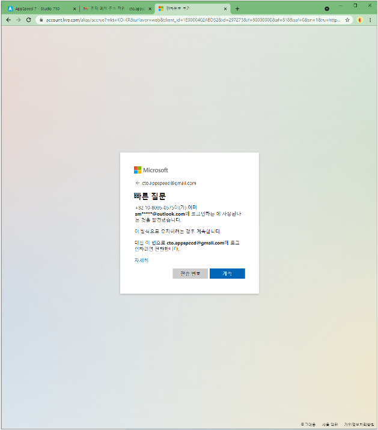
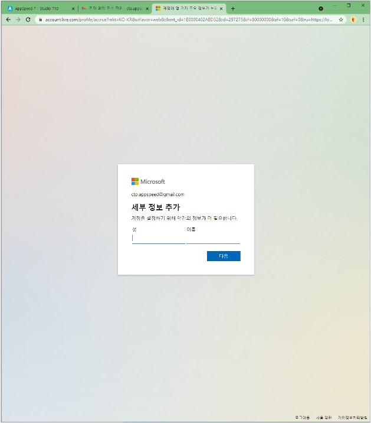
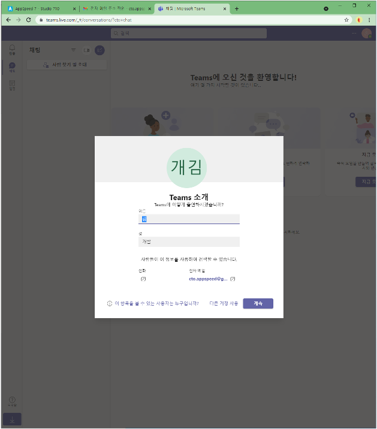
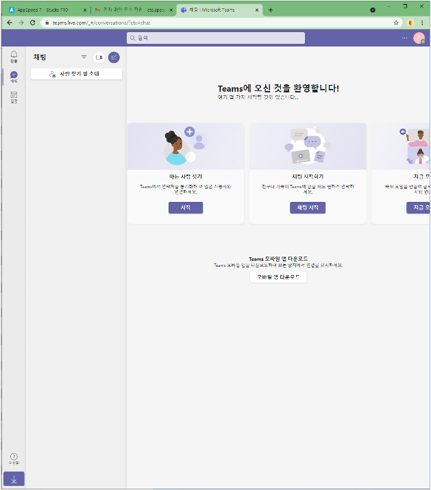
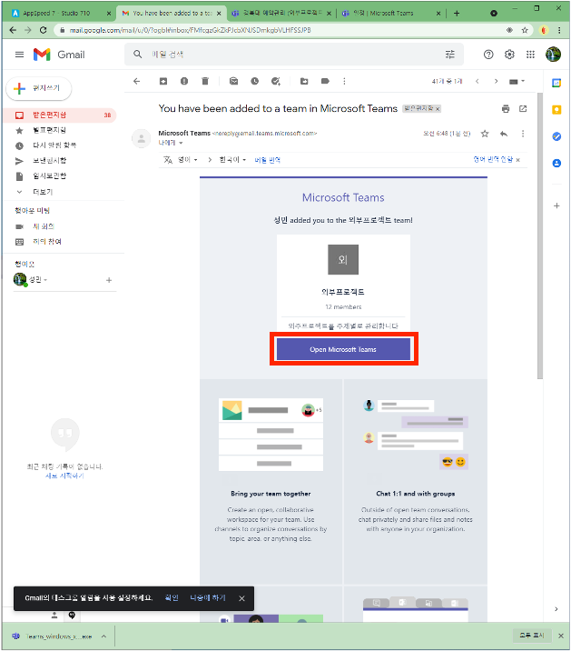
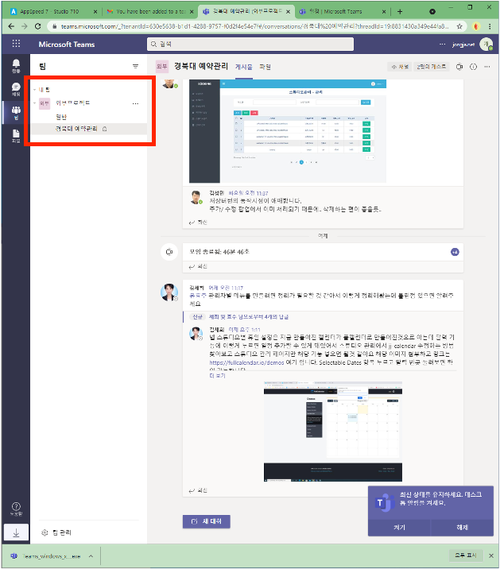

# Microsoft 계정 만들기

#### ❶ 본인의 받은 메일함에서 마이크로소프트로부터 초대받은 메일에서 하단에 `Accept invitation`을 클릭해 줍니다.

#### ❷ 아래의 순서대로 계정을 만들어 줍니다

 

 

 

 

 

   
 

#### 위의 과정대로 계정을 만들었다면, Teams.microsoft.com으로 이동해 줍니다.

#### 

#### 

#### ❸ 아래의 이미지대로 팀스에 위에서 만든 계정을 이용하여 로그인해 줍니다.

#### 로그인했으면 팀스의 프로필 설정합니다.

프로필을 설정하고 보면 아래처럼 아직 팀스에 채널이 추가가 안된 것을 볼 수 있습니다. 

다시 받은 메일함으로 가서 팀스의 초대메일의 `Open Microsoft Teams` 를 눌러 줍니다.

아래의 화면처럼 팀에 채널이 추가된 것을 볼 수 있습니다. 

