# 표준단어(표준화관리/등록요청/표준단어)

## 표준단어(표준화관리/등록요청/표준단어)

#### &#x20;1. 페이지 이동

표준화관리/등록요청/표준단어 페이지로 이동합니다.

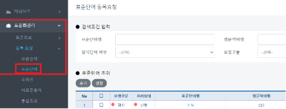

#### &#x20; 2. 표준단어 등록&#x20;

추가 버튼 클릭시 하단 상세정보에 입력할 수 있는 폼이 표시됩니다. 직접 단어를 입력해서 등록하거나 하단에 사전 검색 버튼을 클릭하여 단어를 등록할 수 있습니다.

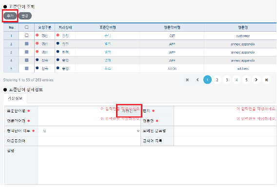

#### &#x20; 3. 사전검색

사전검색 클릭시 다음과 팝업이 표시되며 등록하고자 하는 단어를 입력후 **ENTER or 조회**를 클릭합니다. 비표준용어 검색결과중 원하는 결과 하나를 선택합니다.

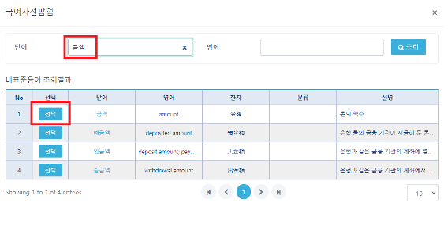


참고: 기존에 등록되었던 **표준단어명, 영문약어명** 은 Unique Key이므로 중복검사를 자체적으로 실시합니다.&#x20;


#### 도메인, 표준용어 또한 동일합니다. ex)**도메인명, 표준용어명**만약 같은 기존에 등록된 **표준단어, 영문약어명** 입력하면 표시되는 화면은 다음과 같습니다.

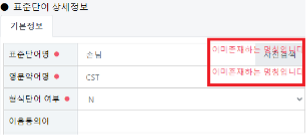

#### &#x20; 4. 단어등록

위에서 선택을 누른 기본 내용들이 폼으로 반영되며 작성 완료후 저장버튼을 클릭합니다.

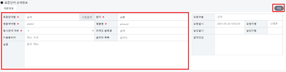

#### &#x20; 5. 단어 등록 확인

금액 이라는 단어로 등록신청 후 표시되는 화면입니다. 체크박스를 클릭하면 승인 또는 반려건수에 대해서는 체크박스가 활성화 되지 않습니다.

신청 상태일시에 **삭제** 또는 **변경**이 가능합니다.

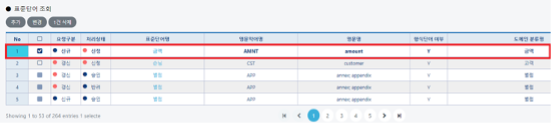

#### &#x20; 6. 승인페이지 이동

금액 이라는 단어에 대해서 승인처리를 하려고 합니다.&#x20;

표준화관리/승인결과현황/승인결과현황 페이지로 이동합니다.

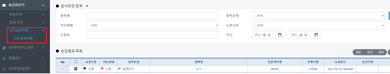

#### &#x20; 7. 승인

체크박스 클릭 후 승인버튼을 클릭합니다.

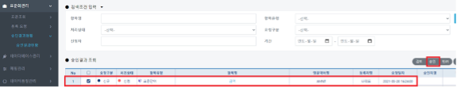

#### &#x20; 8. 승인 확인

승인처리되어 체크박스가 비활성 처리 되었고 처리상태 또한 승인으로 변경된 것을 확인합니다.

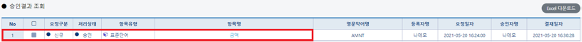

#### &#x20; 9. 표준단어 확인(1)

승인 처리된 금액 이라는 단어를 조회합니다. 표준화관리/표준조회/단어조회 페이지로 이동합니다.


참조: 해당 페이지(**표준조회**)는 **승인 처리된 내역**들만 확인할 수 있습니다.&#x20;

표준단어명에 금액 이라는 단어를 입력후 **ENTER or 조회**를 클릭합니다.

추가옵션으로 형식단어 여부 Filter에서 **Y or N** 을 선택하실 수 있습니다.


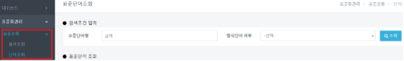

#### &#x20; 10. 표준단어 확인(2)

정상적으로 금액 이라는 단어가 승인이 되어 **표준조회** 페이지에서 확인이 가능합니다

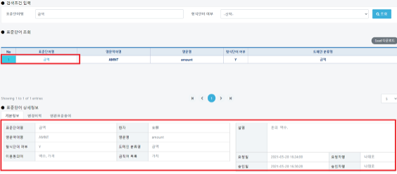

###
