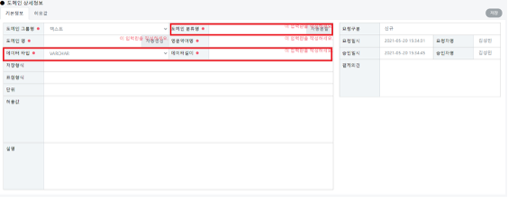
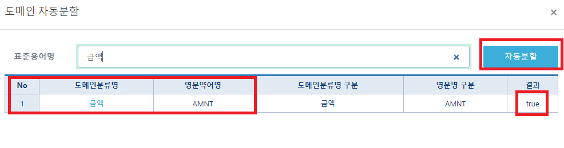

# 도메인(표준화관리/등록요청/도메인)

## 도메인(표준화관리/등록요청/도메인)

#### &#x20; 1. 페이지 이동

표준화관리/등록요청/도메인 페이지로 이동합니다.

#### &#x20; 2. 도메인 검색

도메인명, 도메인 그룹명, 요청구분 별로 검색할 수 있으며 아래의 추가버튼을 클릭하면  등록 폼이 초기화 됩니다.&#x20;

#### &#x20; 3. 도메인 추가

추가 버튼 클릭시 표시 되는 폼화면입니다. 메인 분류명의 **자동분할** 버튼을 클릭 or 등록하고자 하는 TEXT를 입력. ENTER 키를 입력합니다.

#### &#x20; 4. 자동분할

앞서 등록한 금액 이라는 단어를 도메인으로 등록하려고 합니다.  금액이라는 단어 입력 후 자동분할 버튼을 클릭하면 아래와 같이 표시됩니다.


검색기준: 승인 처리된 **표준단어** or **표준용어** 만 조회 가능합니다. 결과값이 true인 것(승인), false(미승인)로 표시됩니다.


#### &#x20; 5. 세부 정보 입력

**데이터길이**를 입력하고 **자동생성** 버튼을 클릭합니다.&#x20;

도메인명은 **도메인분류명+데이터타입+데이터길이**의 조합으로 생성됩니다.

