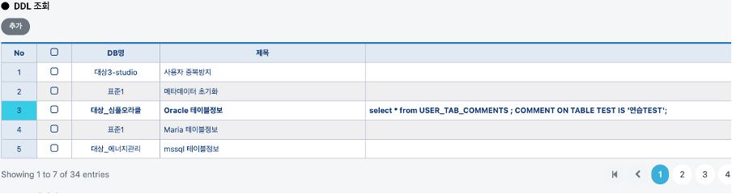
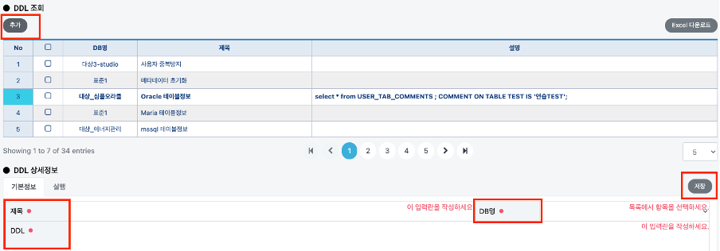
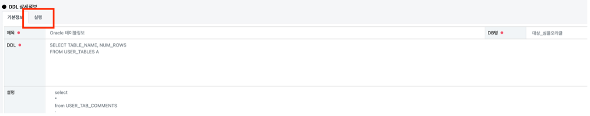

# DB 구문 관리

## DB 구문 관리

관리자, 모델러는 해당 메뉴페이지에 접근 가능합니다.

### DDL 검색 조건

DB명과 제목으로 DDL을 검색할 수 있습니다.

### DDL 조회

DDL 실행에 필요한 구문들을 추가, 저장하여 필요 시에 참조할 수 있습니다.

###

### DDL 추가

`추가` 버튼을 누르면 아래의 상세정보 내용이 초기화 됩니다. 알맞는 제목, DDL, DB명을 입력하여 저장합니다.

### DDL 실행

실행 전 DDL 구문과 실행 할 DB명을 반드시 확인합니다.


DDL 실행 시에는 아래의 화면에서 실행 탭을 클릭하여 실행하여 아래 기재된 쿼리를 실행합니다. 또한 HeidiSQL, DataGrip같은 DB management tool을 이용하여 직접 실행시킬 수 있습니다.


##
