# DBC 조회

## DBC 조회

관리자, 모델러는 해당 메뉴페이지에 접근 가능합니다.

### 기본 정보

아래 그림과 같이 좌측의 tree는 META정보를 표시합니다. 좌측에 클릭하는 내용(db or table)에 따라 기본 정보가 표시됩니다. 아래와 같이 테이블(`jj_data_domain`)을 클릭하였을 때에는 원하는 컬럼에 PK와 Index를 추가할 수 있는 기능이 있습니다.

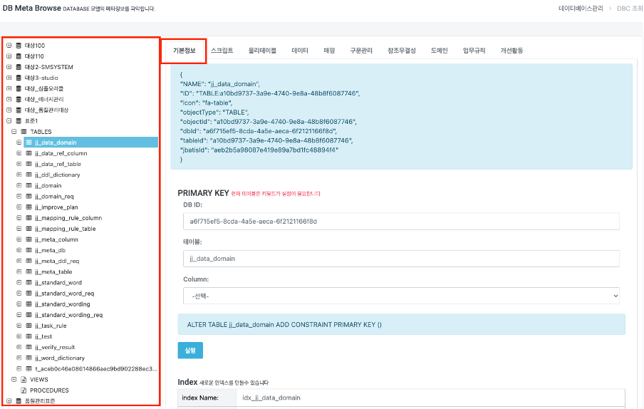

&#x20;DB(표준1)를 클릭 하였을 때 META 정보와 SCHEME 정보를 조회합니다.(매핑정보확인)

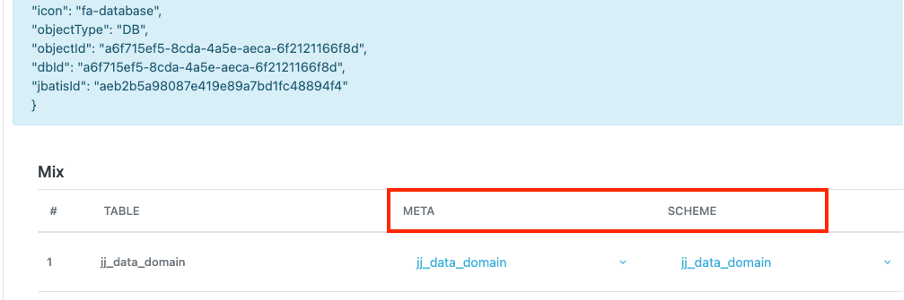

Mapping이 되지 않은 테이블이 대하여 아래와 같이 설정할 수 있습니다.&#x20;

아래의 그림은 두가지의 경우입니다.&#x20;

1. 물리적테이블은 존재하지만 테이블에 대한 Meta정보가 없는 상태(23번)
2. 메타데이터는 존재하지만 물리 테이블은 존재하지 않는 경우입니다(24번)

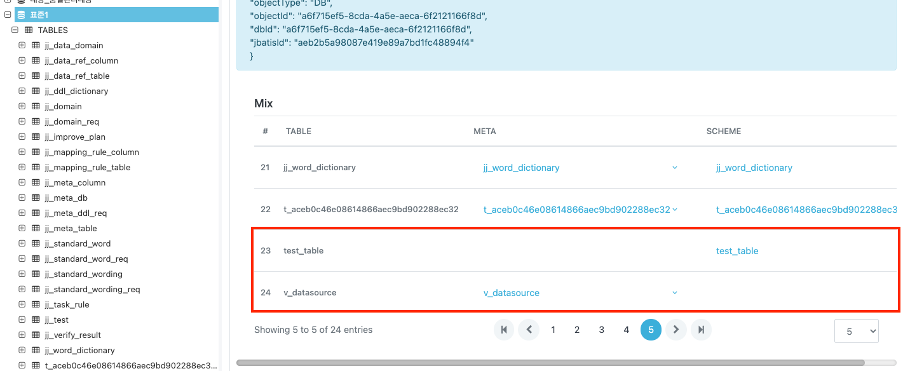

**우선 첫번째의 경우는 아래 그림과 같이 Import시켜 메타데이터를 생성시킬 수 있습니다.**

`Import`를 클릭하면

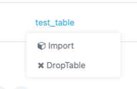

아래와 같이 메타정보를 생성한 것을 확인할 수 있습니다.

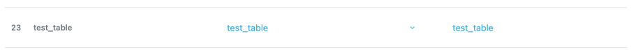

**두번째의 경우 또한 META테이블 선택 후 `CREATE`를 클릭하면 물리 테이블(SCHEME)을 생성하거나 삭제할 수 있습니다.**

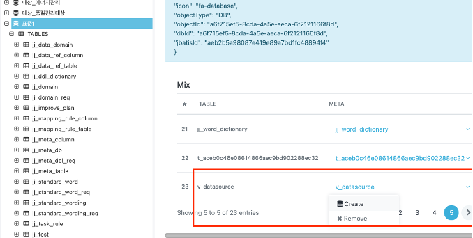

또한 현재 Meta 정보와 물리 DB의 매핑값을 비교하여 확인할 수 있습니다. `m`표시된 아이콘이 Meta 정보와 실제 물리 DB의 매핑이 완려된 상태로 볼 수 있습니다.

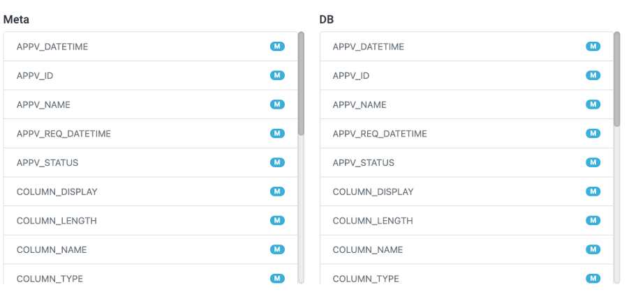

### 스크립트

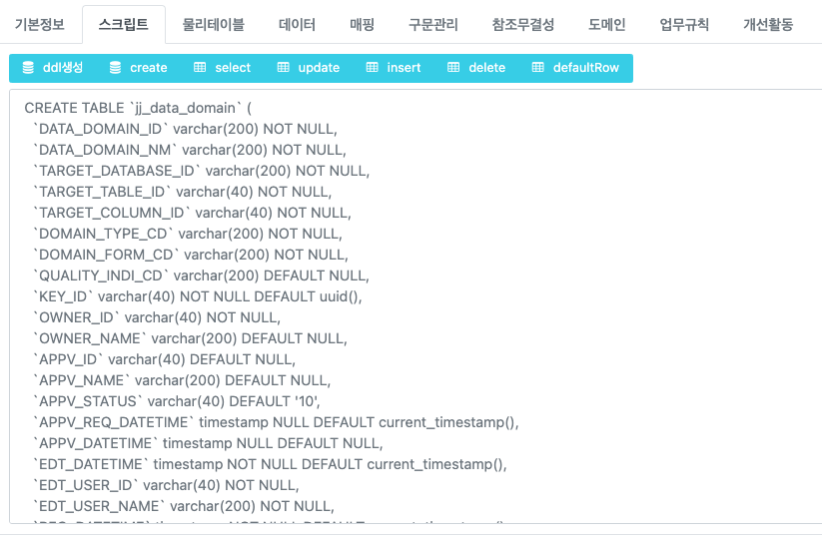

| 요소         | 설명                                        |
| ---------- | ----------------------------------------- |
| ddl생성      | 실제 DB서버에서의 물리적 데이터를 기반으로 생성해주는 DDL 구문입니다. |
| create     | ddl생성과 내용은 비슷해 보이나 META 정보를 기반으로 생성합니다.   |
| select     | META 정보를 기반으로 select문을 생성합니다.             |
| update     | META 정보를 기반으로 update문을 생성합니다.             |
| insert     | META 정보를 기반으로 insert문을 생성합니다.             |
| delete     | META 정보를 기반으로 update문을 생성합니다.             |
| defaultRow | META table의 구성 컬럼들을 표시합니다.                |

### 물리테이블

실제 물리테이블 정보를 META 정보로 import 시킬 수 있습니다.

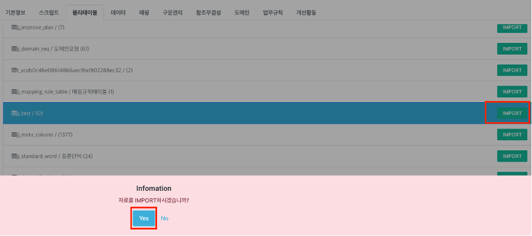

> Import 버튼을 클릭하면 SCHEME 정보를 기반으로 한 META 정보로 Import 됩니다.

이 기능은 앞에 기본 정보에서 사용하였던 기능과 동일합니다.

### 데이터

해당 테이블을 select 문을 이용하여 데이터를 표시합니다.

### 매핑

대상 테이블과 표준화 테이블의 매핑된 관계를 표시합니다. 매핑이 되지 않았다면 빈칸으로 표시됩니다.

### 구문관리

이 탭은 DB를 선택했을 때 조회가 가능하며 앞의 DB 구문 관리의 기능과 비슷합니다. 그리고 해당 DB의 DDL을 표시합니다.

### 참조무결성

대상 테이블의 부모 테이블 정보를 표시합니다. 참조무결성을 등록하지 않았다면 빈칸으로 표시됩니다.

### 도메인

다음은 품질관리표준(DB)의 test\_journal(TABLE)의 도메인 표시 내역입니다. 내용은 도메인 규칙을 추가한 대상 컬럼의 대한 정보를 표시합니다.

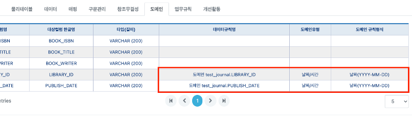

### 업무규칙

다음은 품질관리표준(DB)의 test\_journal(TABLE) 정보입니다. 대상 SQL, 진단 SQL을 등록한 컬럼에 대한 정보를 표시합니다.

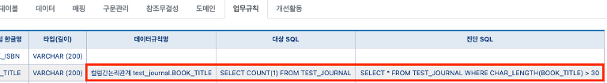

### 개선활동

해당 테이블 및 컬럼의 개선 활동에 대한 내역(요청구분, 처리상태, 대상DB 및 테이블 컬럼 등)을 표시합니다.

