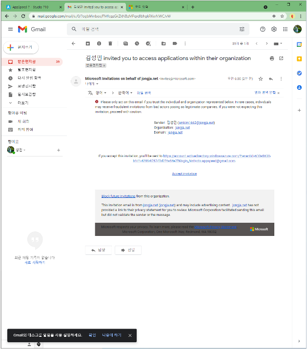
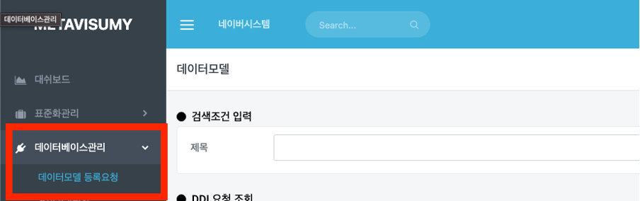
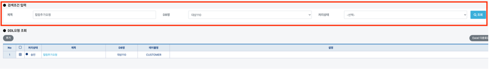
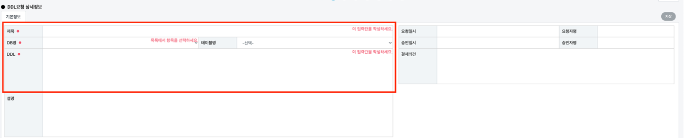

# 데이터 모델 등록 요청

## 데이터 모델 등록 요청

[https://svc.appspeed.net/apps/metamanager](https://svc.appspeed.net/apps/metamanager) 로 접속하여 로그인합니다.

로그인 후 `데이터베이스관리` -> `데이터모델 등록요청` 메뉴로 이동합니다.


데이터모델 등록요청 메뉴에서는 일반 사용자, 모델러, 개발자, 관리자의 역할을 가진 인원들이 요청하고자하는 DDL구문을 등록 요청할 수 있습니다.


### 검색 기능

아래 화면과 같이 알맞게 검색조건(제목, DB명, 처리 상태)등을 이용하여 기존에 등록된 요청들을 검색하실 수 있습니다.

### 등록 요청

`추가` 버튼을 클릭했을 때 표시되는 화면은 아래와 같습니다.


제목, DB명, 테이블명, DDL 구문을 입력하는 창이 공백으로 표시됩니다. 해당 필수 사항들을 입력하고 `저장` 버튼을 누르면 처리 상태 값은 **요청** 상태입니다.


#### &#x20;&#x20;
