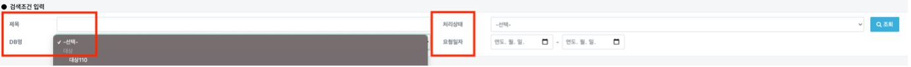
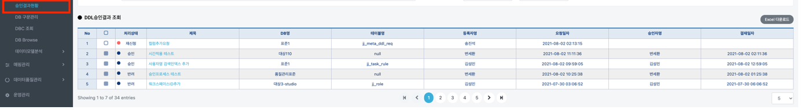
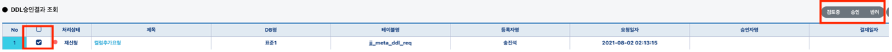
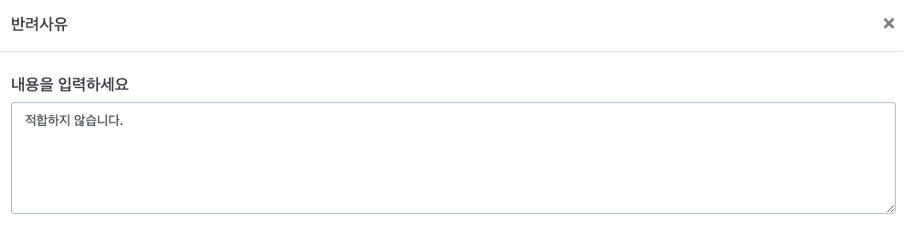

# 승인 결과 현황

## 승인 결과 현황

관리자, 모델러는 해당 메뉴페이지에 접근 가능합니다.

### 검색 조건 입력


제목, 처리 상태, DB명, 요청 일자의 조건으로 승인 결과들을 조회할 수 있습니다.


###

### 결제 프로세스

최초 요청했을 때 처리 상태는 **요청**이며 관리자의 결제 종류에 따라 **반려**, **검토중**, **승인**, **재신청** 상태로 나뉩니다.

| 상태  | 설명                                                                                           |
| --- | -------------------------------------------------------------------------------------------- |
| 반   | 
해당 요청에 대해서 반려 처리합니다. 

반려된 요청에 대해서는 요청한 데이터를 수정하여 <strong>재신청</strong> 할 수 있습니다.
 |
| 검토중 | 
들어오는 요청을 검토합니다. 

상황에 따라서 승인하거나 반려하기가 명확하지 않은 경우에 사용합니다.
                         |
| 승인  | DB의 DDL을 승인합니다. 이에 따라 관리자는 해당 DDL을 실행합니다.                                                    |
| 재신청 | 이전에 반려되었던 요청이 들어온 경우입니다. 반려하거나 승인할 수 있습니다.                                                   |

####

#### 재신청(예시)

**재신청**이나 **요청**의 상태의 건수를 gird에서 체크박스를 클릭하면 우측상단에 검토중, 승인, 반려 버튼이 활성화됩니다.


만약 반려 처리를 하고 싶다면 다음과 같이 반려 사유를 입력할 수 있는 창이 활성화됩니다. 알맞는 메시지를 입력 후 **ok** 버튼을 클릭하면 반려 처리가 됩니다.


