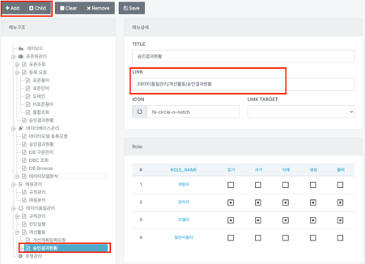
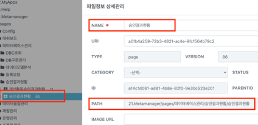
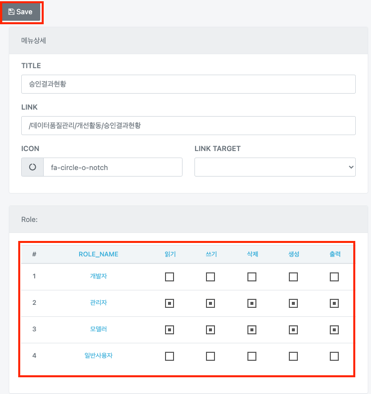

# 메뉴 관리

## 메뉴 관리

해당 탭에서는 페이지를 추가하거나 삭제 및 권한 수정이 가능합니다.

### 페이지 추가

`Add` 버튼 혹은 `child` 버튼을 통해 페이지를 추가합니다. **LINK**의 값은 studio 페이지의 **name**값과 동일해야 합니다.

> ex) /데이터품질관리/개선활동/승인결과현황

다음은 스튜디오에서 파일정보 상세관리 페이지 입니다.

### 권한 수정

해당 페이지에서의 권한을 수정할 수 있습니다. 각 역할에 따라 보여지는 페이지를 제한하거나 해제할 수 있습니다.

