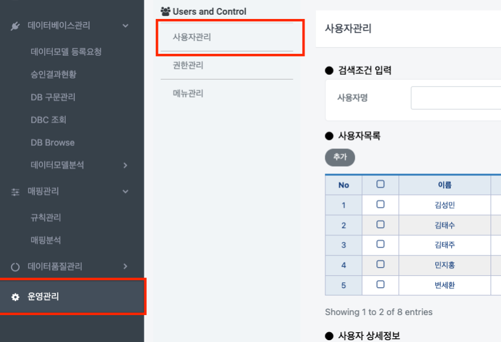
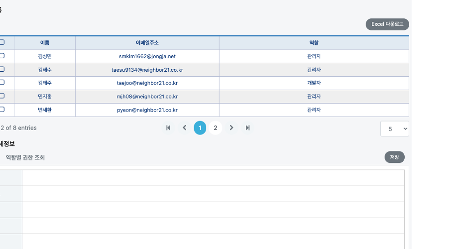
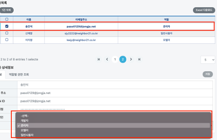

# 사용자 관리

## 사용자 관리

### 검색&#x20;

사용자의 이름 또는 역할을 이용해서 유저 조회가 가능합니다.

### 사용자 추가

아래의 `추가` 버튼을 누르면 사용자 추가가 가능합니다. 아래의 사용자 상세정보 그리드가 초기화되며 사용자 정보를 입력 후 `저장` 버튼을 누릅니다.

### 사용자 역할 변경

그리드에서 해당 사용자 클릭 후 변경할 역할을 선택 후 `저장` 버튼을 클릭합니다.

