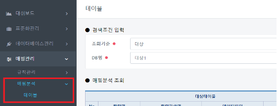
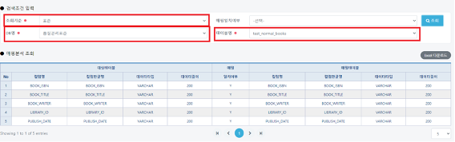
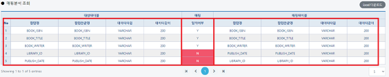
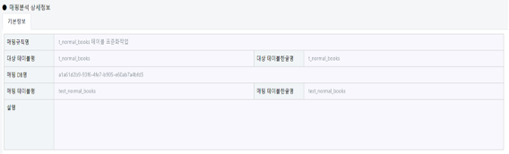

# 매핑분석

## 테이블(매핑관리/매핑분석/테이블)

#### &#x20; 1. 페이지 이동

매핑관리/매핑분석/테이블 페이지로 이동합니다.

#### &#x20; 2. 매핑분석 조회

매핑규칙관리에서 등록했던 내용을 조회합니다.

조회기준(**표준**), DB명(**품질관리표준**), 테이블명(**test\_normal\_books**)을 선택후에 **조회**버튼클릭

매핑 일치가 맞지 않다고 하면 다음과 같이 표시됩니다.&#x20;

**일치여부(N)**의 예시는 다음과 같습니다.

**t\_normal\_books.LIBRARY\_ID ≠ test\_normal\_books.PUBLISH\_DATE**

**t\_normal\_books.PUBLISH\_DATE ≠test\_normal\_books.LIBRARY\_ID**&#x20;

#### &#x20; **3. 매핑분석 상세정보**

대상 테이블정보와 매핑 테이블정보가 표시됩니다.

****
