# 규칙관리

## 규칙관리(매핑관리/규칙관리/규칙관리)

&#x20;&#x20;

#### &#x20; 1. 페이지 이동

매핑관리의 규칙관리 페이지로 이동합니다

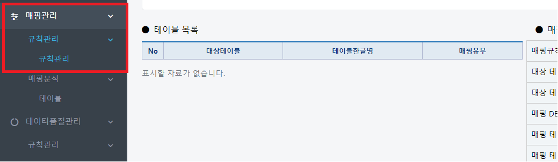

&#x20;&#x20;

#### &#x20; 2. DB 선택

대상DB명(품질관리대상)을 선택하고 조회버튼을 클릭합니다.

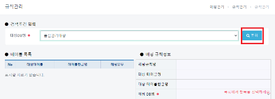

#### &#x20; 3. 매핑 규칙 정보 등록

(1) 테이블 목록에서 t\_normal\_books 테이블을 선택후 우측 **추가** 버튼을 클릭합니다.

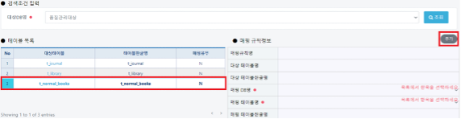

(2) 이후 DB명(품질관리표준), 테이블명(test\_normal\_books)선택후 **저장**버튼을 클릭합니다.

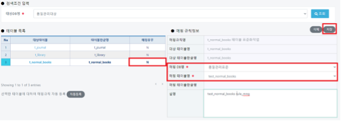

(3) 저장버튼을 클릭시 매핑유무 **N->Y** 로 변경됩니다.&#x20;

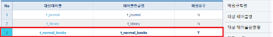

#### &#x20; 4. 매핑추가

매핑추가 버튼을 클릭합니다.

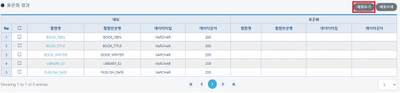

아래와 같이 표준화팝업창이 표시됩니다. 대상테이블의 컬럼과 표준화 테이블에서 매핑할컬럼을 선택하고 **추가** 버튼을 클릭합니다. 모든 컬럼에 적용하고 팝업창을 닫습니다.

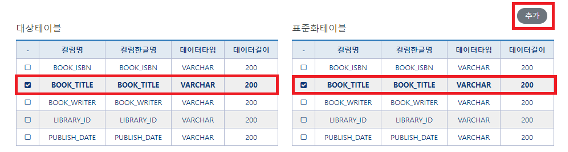


자동등록

대상테이블과 표준화테이블의 컬럼명, 컬럼한글명, 데이터타입, 데이터길이가 모두 일치하는 경우 자동등록 기능을 사용하실 수 있습니다.예시의 **t\_normal\_books**와 **test\_normal\_books**의 컬럼 정보가 동일 하므로 자동등록 기능을 사용할 수 있습니다.&#x20;


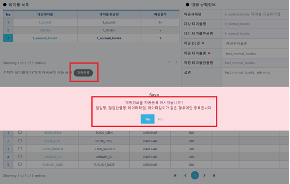

#### &#x20; 5. 매핑추가 결과

대상테이블(**t\_normal\_books**)과 표준테이블(**test\_normal\_books**) 매핑결과 화면입니다.

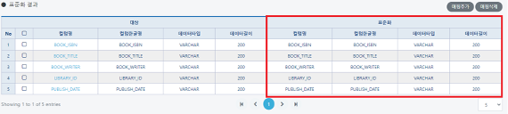

#### &#x20; 6. 매핑삭제

해당 매핑정보 체크박스를 클릭하여 매핑삭제 버튼을 누르면 매핑삭제가 가능합니다.

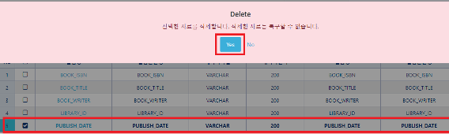

삭제 후 화면입니다.

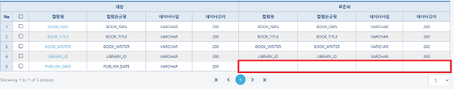

또한 기존에 등록한 매핑 테이블 정보 또한 **삭제**가 가능합니다.

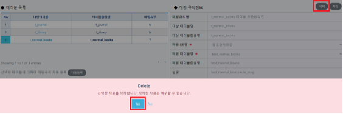

매핑유무가 삭제되어 **Y->N** 으로 변경되었으며 기존 등록된 정보가 삭제됩니다.

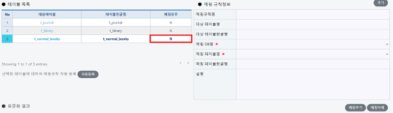

