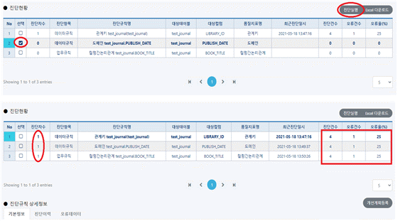
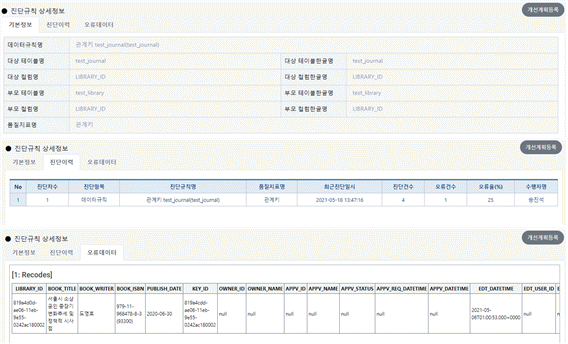

# 진단실행

## 진단현황(데이터품질관리/진단실행/진단현황)

#### &#x20; 1. 페이지 이동

데이터품질관리/진단실행/진단현황 페이지로 이동합니다.

#### &#x20; 2. 조회하기

진단항목(참조무결성, 도메인), 업무규칙을 조회합니다. DB명(품질관리표준)을 선택한 후에 조회 버튼을 클릭합니다.

&#x20;앞서 등록했던 참조무결성, 도메인, 업무규칙에 대한 내용이 표시됩니다.

#### &#x20; 3. 진단실행

각 진단항목에서 체크박스를 선택한후에 진단실행 버튼을 클릭하면 진단실행이 됩니다.

진단실행이 정상적으로 완료되면 진단차수가 0->1 로 변경되며 앞서 등록한 참조무결성, 도메인, 업무규칙 3가지 건수 모두 진단을 실행합니다.&#x20;

#### &#x20; 4. 진단실행 상세정보

그리드에서 해당 데이터를 클릭하면 진단 실행한 해당 데이터에 대해 상세정보를 확인할 수 있습니다.&#x20;

기본정보, 진단 이력, 오류 데이터를 확인할 수 있으며 아래의 예시는 **TEST\_JOURNAL** 테이블의 참조무결성 진단 결과입니다.&#x20;

#### &#x20; 5. 개선계획등록

(1) 진단현황 페이지에서 **개선계획등록** 버튼 클릭

(2) 개선 계획 작성

버튼을 클릭하게 되면 표시되는 팝업창 입니다. 적절한 설명과 개선SQL을 작성한 후에 하단에 OK버튼을 누르게 되면 개선계획 등록요청이 됩니다.&#x20;

아래 예시의 SQL은 진단규칙 상세정보의 오류 데이터를 참고 합니다. 관계키를 맞춰주기 위한 개선SQL은 다음과 같습니다.

> \-설명: **test\_journal 테이블에서 부적절한 LIBRARY\_ID발견. 변경 신청합니다.**
>
> \-개선SQL: **UPDATE test\_journal SET LIBRARY\_ID = '2e69d35e-ae02-11eb-9e55-0242ac180002' WHERE LIBRARY\_ID = '819a4d0d-ae06-11eb-9e55-0242ac180002’**

****

