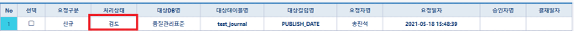
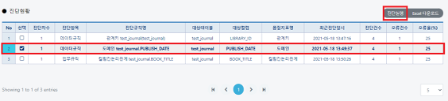

# 승인결과현황

## 승인결과현황(데이터품질관리/개선활동/승인결과변황)

#### &#x20; 1. 페이지 이동

페이지로 이동하여 조회버튼을 클릭 하였을 때 화면입니다.

#### &#x20; 2. 결제처리

앞서 등록한 3가지 요청건수에 대해 검토, 승인, 반려 처리를 해보겠습니다.

(1) 검토처리&#x20;

관리자가 해당요청 사항에 대해서 검토가 필요할 때 사용합니다.

&#x20;대상 컬럼 **PUBLISH\_DATE**에 대해서 검토 처리를 예시로 들어보겠습니다. **PUBLISH\_DATE**는 도메인 규칙 처리 컬럼이었습니다.&#x20;

진행방법은 아래 그림과 같습니다. 해당 데이터를 그리드에서 체크박스 클릭후 검토버튼을 누릅니다.

관리자가 검토버튼을 누르게 되면 표시되는 화면은 아래와 같습니다.

이때 해당 요청을 한 사용자는 승인자가 검토중이므로 추가적으로 수정, 저장 또는 삭제를 할 수 없습니다. 아래는 **TEST\_JOURNAL.PUBLISH\_DATE**에 대한 개선계획요청등록 화면입니다.&#x20;

(2) 승인처리

앞서 반려한 건수를 승인처리 해보겠습니다. 검토중인 요청건을 승인처리를 위해 승인 버튼을 눌러줍니다.

아래 화면은 관리자 승인 이후의 처리 화면입니다. 승인이 되면 체크박스는 DISABLE로 변환됩니다.

관리자 승인 이후에 요청에 관한 개선SQL

> **UPDATE TEST\_JOURNAL SET PUBLISH\_DATE = '2020-06-08' WHERE KEY\_ID='1394b763-ae06-11eb-9e55-0242ac180002'**

을 실행시킵니다. 이후 데이터품질관리/진단실행/진단현황 페이지로 들어가서 해당 규칙( TEST\_JOURNAL.PUBLISH\_DATE) 확인하고 진단실행 버튼을 클릭.

**진단실행** 버튼을 클릭하면 아래와 같은 화면이 표시 됩니다. 승인이후(개선SQL실행후) 해당 규칙에 대한 진단 차수가 1회 증가 하였고 오류건수 또한 1에서 0으로 변경되었습니다.&#x20;

그러므로 오류데이터 탭에서 결과 건수가 0건이라고 표시 되는 것을 확인할 수 있습니다.

또한 진단 이력 탭에서도 기존 진단이력들을 최근진단일시 기준으로 조회 가능합니다.

같은방법으로 1번 관계키(test\_journal.LIBRARY\_ID)도 승인처리를 해줌과 동시에 개선SQL

> **UPDATE test\_journal SET LIBRARY\_ID = '2e69d35e-ae02-11eb-9e55-0242ac180002' WHERE LIBRARY\_ID = '819a4d0d-ae06-11eb-9e55-0242ac180002’**

위의 SQL을 실행킵니다.

데이터품질관리/진단실행/진단현황 페이지로 들어가서 해당 규칙(test\_journal(test\_journal)) 확인하고 **진단실행** 버튼을 클릭해 줍니다. 정상적으로 실행이 되면 아래와 같은 화면이 표시됩니다.

(3) 반려처리

업무규칙(test\_journal.BOOK\_TITLE)반려 처리 프로세스와 결과화면입니다

개선계획등록요청 페이지에서 확인시 표시되는 화면은 다음과 같습니다. 반려건수에 대해 재신청버튼이 생성되며 재신청 버튼을 누르면 다시 수정하여 신청할 수 있습니다.

재신청 버튼을 클릭하여 내용을 수정한 후 저장버튼을 누르게 되면 신청이 됩니다.

저장버튼을 클릭.

관리자 승인페이지(승인결과현황)에서 확인합니다. **요청구분=변경**, **처리상태=재신청**으로 변경된 것을 확인할 수 있으며 승인을 버튼을 클릭합니다.

개선SQL을 실행하여 내용을 해당 BOOK\_TITLE 컬럼을 수정합니다.

> 개선SQL:
>
> **SELECT \* FROM TEST\_JOURNAL WHERE CHAR\_LENGTH(BOOK\_TITLE) > 30 ORDER BY BOOK\_TITLE**&#x20;

진단실행을 하여 최종 결과를 확인합니다.

