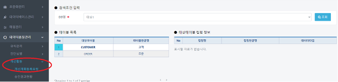
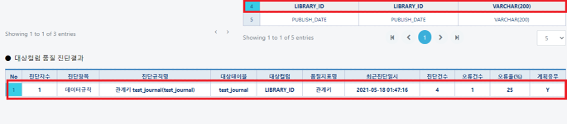
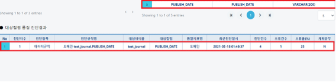
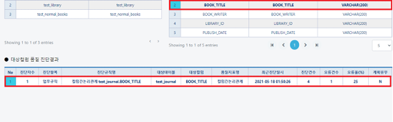
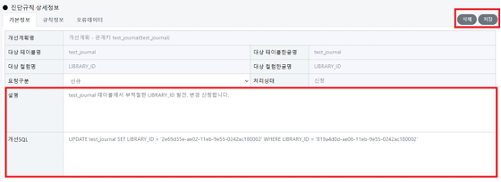
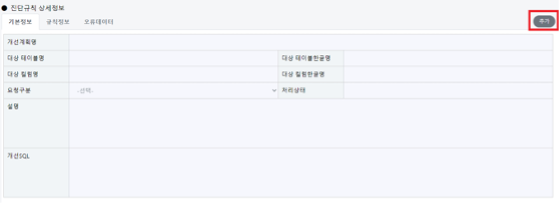
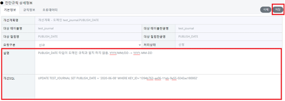
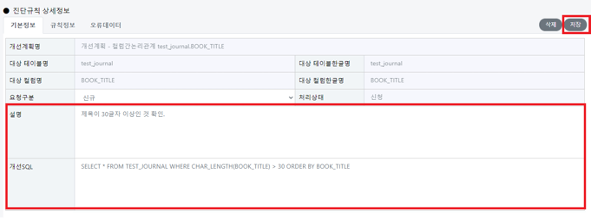
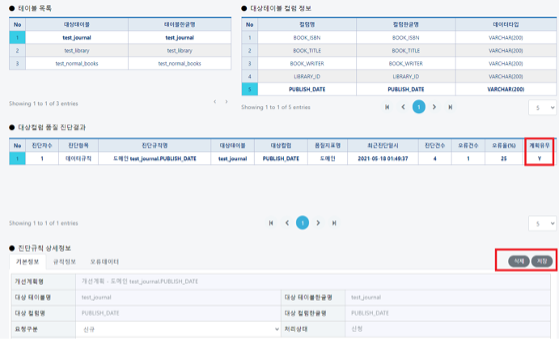

# 개선계획등록요청

## 개선계획등록요청(데이터품질관리/개선활동/개선계획등록요청)

#### &#x20; 1. 페이지 이동

페이지로 이동하였을때의 기본화면입니다.

#### &#x20; 2. 조회하기

DB명은 품질관리표준을 선택하고 조회버튼을 누르면 아래와 같이 화면이 표시되며. 앞서 진단한 데이터의 테이블과 컬럼값을 찾아 확인 합니다.

&#x20;아래의 예시는 test\_journal 테이블의 BOOK\_TITLE 컬럼을 확인했을 때 표시되는 화면입니다.&#x20;

마찬가지로 도메인 규칙을 등록한 PUBLISH\_DATE, 참조무결성 LIBRARY\_ID 컬럼을 확인 했을 때 아래와 같이 표시됩니다.

\-- 참조: 계획유무**Y?** 개선계획등록 버튼을 눌러 앞서 팝업창으로 이미 신청 한 상태.

#### &#x20; 3. 개선계획등록 요청

(1) 참조무 결성, 개선계획등록 요청

다음 예시같은 경우, 진단현황 페이지에서 개선계획등록 버튼을 눌러 앞서 팝업창으로 신청을 한 상태이므로 설명과 개선SQL의 내용 및 삭제, 저장 버튼이 표시가 됩니다.

(2) 도메인 개선계획등록 요청 추가

앞서 진단결과에 대해 개선계획등록한 내용이 없으면 아래 그림과 같은 화면이 나타나게 됩니다.

**추가** 버튼을 클릭하게 되면 아래화면과 같이 설명과 개선SQL을 작성할 수 있으며 내용에 맞게 작성후 **저장**버튼을 누르게 되면 개선계획등록 요청 양식이 표시됩니다.&#x20;

(3) 도메인 개선계획등록 요청

다음의 예시는 도메인의 규칙(YYYY-MM-DD)과 내부 데이터(YYYY/MM/DD)의 규칙이 맞지 않아 오류건수를 발생하였습니다. 이에 적절한 SQL문은 다음과 같습니다.

> \-설명: **도메인 규칙, 컬럼 타입 불일치. YYYY/MM/DD -> YYYY-MM-DD**
>
> \-개선SQL:  **UPDATE TEST\_JOURNAL SET PUBLISH\_DATE = '2020-06-08' WHERE KEY\_ID='1394b763-ae06-11eb-9e55-0242ac180002’**

작성후 **저장** 버튼을 클릭합니다.

(4) 업무규칙 개선계획등록 요청 화면

아래의 예시는 업무규칙 **BOOK\_TITLE** 컬럼의 데이터 길이에 따른 계선계획등록 요청예시입니다. 제목이 30글자가 넘는 데이터를 찾고 싶을 때 적절한 SQL은 다음과 같습니다.

> \-설명: **제목이30글자 이상인 것 확인.**
>
> \-개선SQL:  **SELECT \* FROM TEST\_JOURNAL WHERE CHAR\_LENGTH(BOOK\_TITLE) > 30 ORDER BY BOOK\_TITLE**

저장 버튼을 클릭합니다.

#### &#x20; 4. 계획 유무 확인

다음 화면은 최종적으로 개선계획등록요청이 등록 되었을 때 표시되는 화면입니다.&#x20;

중앙 그리드 계획유무는 **N->Y**로 변경되고 상세정보 탭 우측에 삭제, 저장 버튼이 표시 됩니다.

