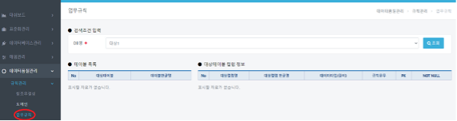
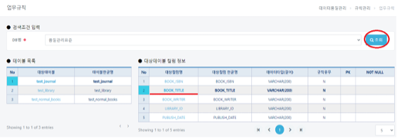
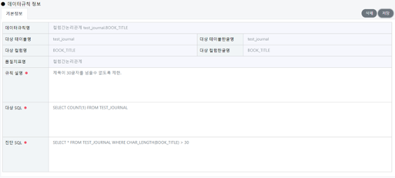
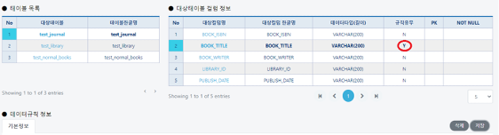

# 업무규칙

## 업무규칙(데이터품질관리/규칙관리/업무규칙)

#### &#x20; 1. 페이지 이동

데이터품질관리/규칙관리/업무규칙 메뉴를 클릭합니다.

#### &#x20; 2. 조회하기

업무규칙을 등록할 DB(**품질관리표준**)를 선택후 조회 버튼을 클릭, **BOOK\_TITLE** 컬럼을 선택합니다.&#x20;

#### &#x20; 3. 업무규칙 정보등록

업무규칙에 대한 설명과 대상 SQL, 진단 SQL을 입력합니다. 아래의 예시는 test\_journal 테이블에서 BOOK\_TITLE 컬럼을 예시로 들었으며 책 제목의 글자수 30글자 이상인 것을 제한하려고 합니다.

&#x20;예시는 다음과 같습니다.

> \-설명: **제목이 30글자를 넘을수 없도록 제한.**
>
> &#x20;\-대상SQL: **SELECT COUNT(1) FROM TEST\_JOURNAL**

> &#x20;\-진단SQL: **SELECT \* FROM TEST\_JOURNAL WHERE CHAR\_LENGTH(BOOK\_TITLE) > 30**

#### &#x20; **4. 규칙등록유무 확인**

해당정보를 입력후 저장버튼을 눌러주면 규칙정보가 등록되며 그리드 화면에서 해당컬럼의 규칙 유무가 **N->Y**로 변경된 것을 확인할 수 있습니다.&#x20;

또한 규칙이 있는 컬럼(**규칙유무Y**)은 삭제 버튼을 누르게 되면 저장된 데이터를 삭제할 수 있습니다.&#x20;

