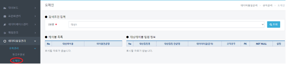
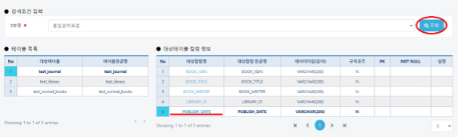
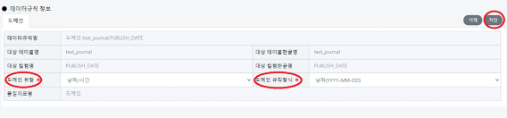
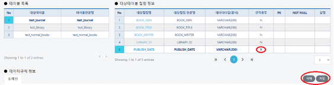

# 도메인

## 도메인(데이터품질관리/규칙관리/도메인)

#### &#x20; 1. 페이지 이동

데이터품질관리/규칙관리/도메인 메뉴를 클릭합니다.

#### &#x20; 2. 조회하기

DB명(품질관리표준을 선택한 후 조회 버튼을 클릭합니다. 좌측(test\_journal)에 대한 컬럼 정보가 우측 그리드에 표시됩니다. 좌측의 각 테이블에 대하여 우측에서 컬럼정보를 표시합니다. 날짜 도메인 규칙 형식을 등록하기 위해 **PUBLISH\_DATE**컬럼을 선택합니다.

#### &#x20; 3. 도메인 규칙추가

**PUBLISH\_DATE** 컬럼 선택후에 아래의 추가버튼을 누르게 되면 **PUBLISH\_DATE** 의 규칙정보를 추가하기 위한 테이블(**test\_journal**)과 컬럼정보(**PUBLISH\_DATE)**가 출력됩니다. 아래의 **도메인 유형**에는 날짜/시간을 선택하고 **도메인 규칙형식**은 날짜(YYYY-MM-DD)를 선택합니다. 모두 선택하였으면 우측상단에 저장 버튼을 클릭하면 도메인 규칙정보가 등록됩니다.&#x20;

#### &#x20; 4. 규칙확인

규칙정보를 등록하면 그리드에서 해당 컬럼에 대한 규칙유무 정보가 N->Y 로 변경된 것을 확인하실 수 있습니다. 또한 규칙이 있는 컬럼에 한해 삭제 버튼을 누르게 되면 저장된 데이터를 삭제할 수 있습니다.

