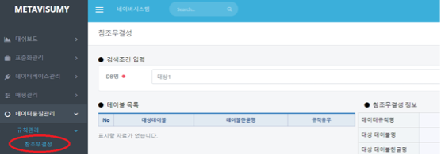
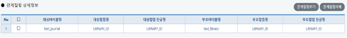

# 참조무결성

## 참조무결성(데이터품질관리/규칙관리/참조무결성)

#### &#x20; 1. 페이지 이동

데이터품질관리/규칙관리/참조무결성 메뉴를 클릭합니다.

&#x20;

#### &#x20; 2. 조회하기

참조무결성 대상이 되는 테이블과 부모테이블을 선택합니다. 다음 화면은 해당 DB(품질관리표준) 선택 후에 조회 버튼을 눌렀을 때 출력 되는 화면입니다.

#### &#x20; 3. 부모테이블 추가

좌측에는 해당 DB(품질관리표준)의 테이블이 표시가 되고 아래에 추가 버튼을 누르게 되면 우측에는 다음과 같은 테이블 정보와 부모 테이블을 선택할 수 있는 내용이 표시 됩니다. 해당되는 부모 테이블을 선택하고 저장버튼을 눌러줍니다.&#x20;

아래의 예시는 대상테이블(test\_journal) 부모테이블(test\_library)입니다.

#### &#x20; 4. 관계컬럼추가

관계컬럼추가 버튼 클릭시 팝업창이 표시 되는데 팝업창의 좌측은 자식테이블(**test\_journal**) 컬럼정보 우측은 부모테이블(**test\_library**) 컬럼정보가 표시되며 관계키(**LIBRARY\_ID**)를 해당 체크박스에서 양측에서 각각 선택한 후에 **추가** 버튼을 누릅니다.&#x20;

#### &#x20; 5. 규칙 확인

관계 컬럼을 추가하면 상세정보에 다음과 같은 화면이 표시됩니다. 필요시에는 관계 컬럼을 더 추가하거나 해당 체크박스를 선택하면 관계 컬럼을 삭제 할 수 있습니다.

