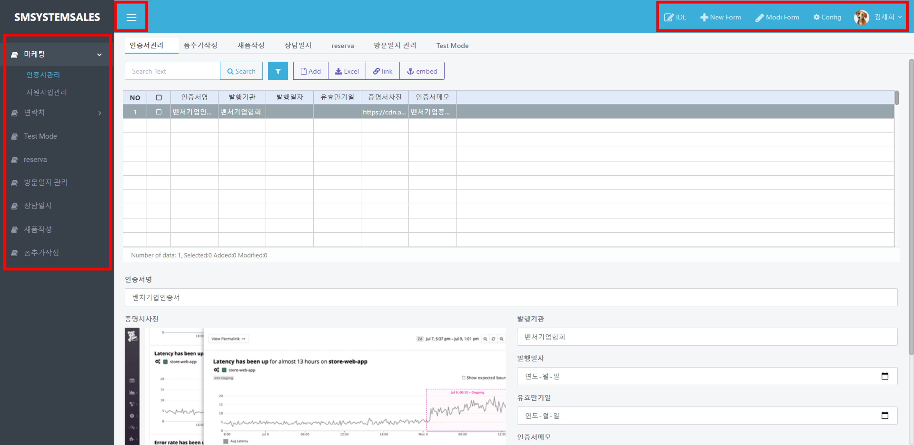
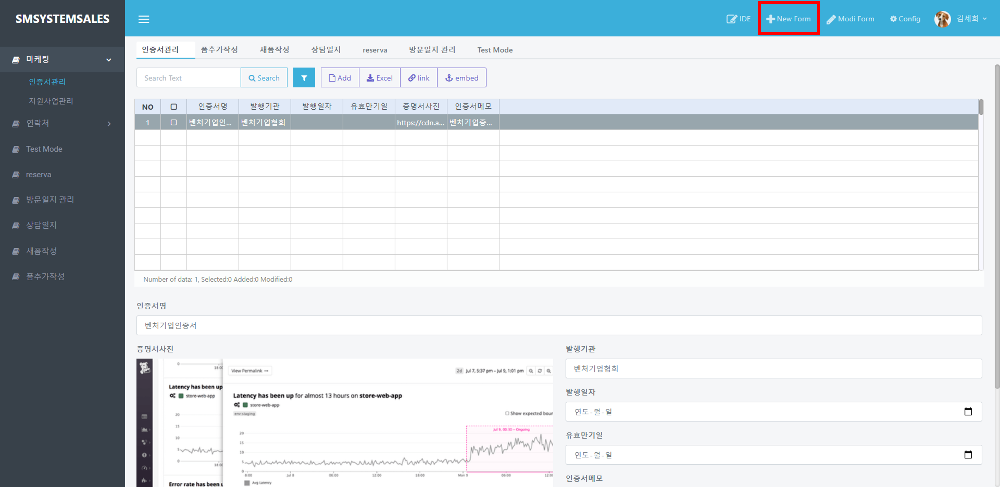
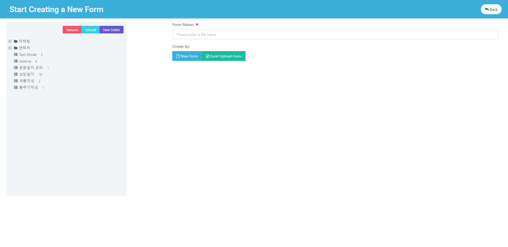
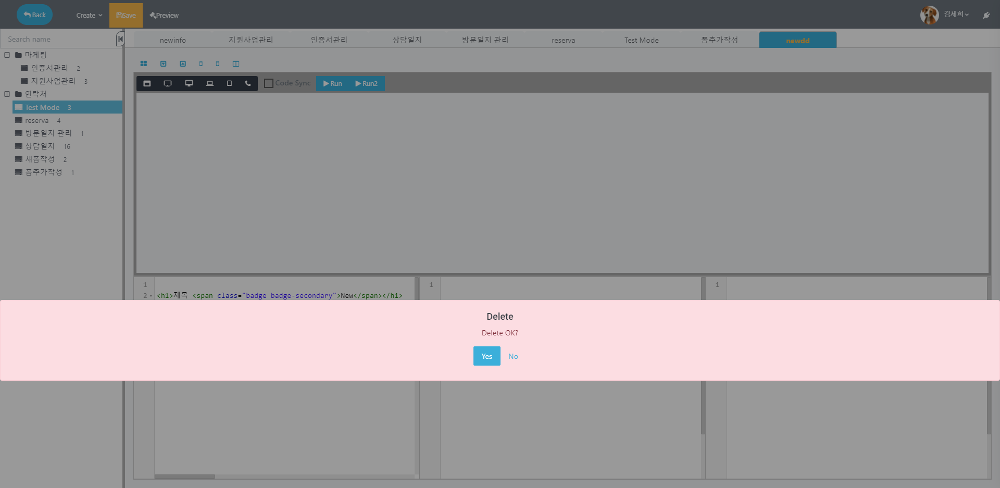

# 앱 구성

## 앱 구성

### 앱 목록 구성

* **좌측 목록**에서 **원하는 폼을 선택**할 수 있습니다.
* **상단 좌측 버튼**으로 좌측 메뉴를 열고 닫을 수 있습니다.
* **상단 우측 버튼**으로 새로운 화면을 **생성**, **수정** 및 **삭제**하거나 구성 요소를 **관리**할 수 있습니다.

### 폼 생성하기

상단의 `newApp`을 클릭하여 새로운 폼을 작성합니다.

**이름**과 **테이블명**을 작성합니다.

**Type**을 선택해서 **엑셀(excel) 파일**을 가져오거나 **새로운 폼**을 작성할 수 있습니다.

좌측 메뉴에서 폼을 작성할 폴더를 생성하거나 삭제할 수 있습니다.

###

### 폼 수정하기

우측 상단의 `modiApp` 버튼으로 폼을 수정할 수 있습니다. \

### 목록 삭제하기

우측 상단의 `IDE` 버튼을 클릭합니다.

삭제할 목록을 우클릭하고 `삭제` 버튼을 클릭합니다. \

`Delete` 알림 창에서 `Yes`를 클릭하면 목록이 삭제됩니다.
