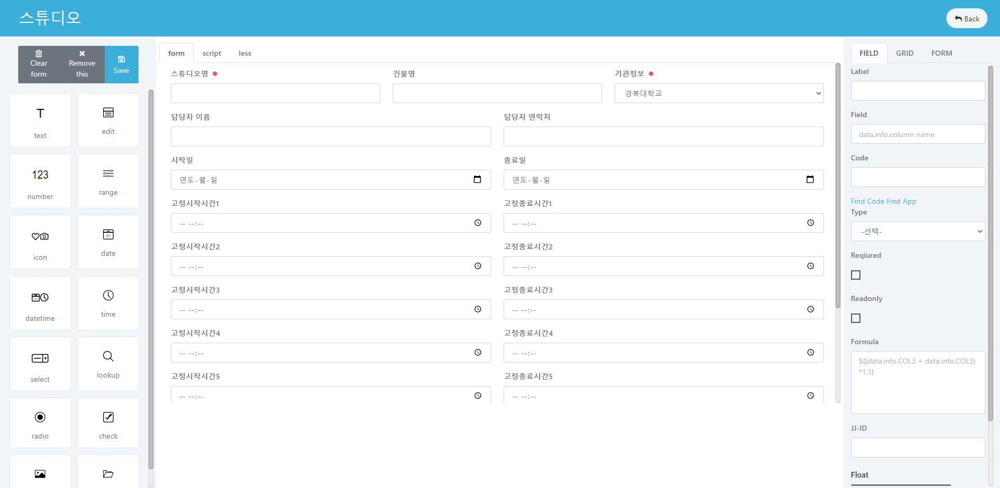
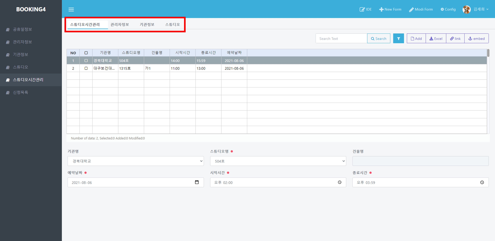
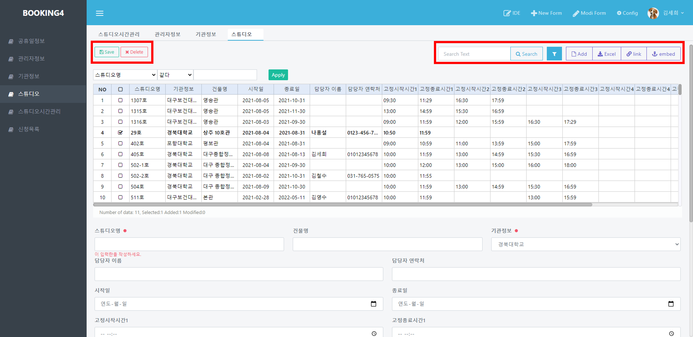
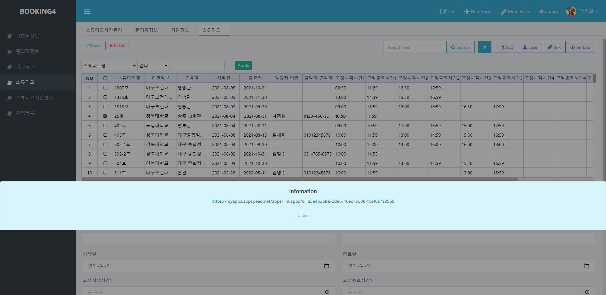

# 엑셀 폼 생성하기

## 엑셀 폼 생성하기

**MyApps Excel Upload Form 생성 동영상**

###

### 엑셀 업로드 폼 생성화면

앱 메인화면에서 **New Form**을 누르면 새 폼을 생성할 창이 뜨고 **Create By**에서 `Excel Upload Form` 버튼을 클릭하면 엑셀 파일을 업로드할 수 있는 창이 뜹니다.

가지고 있는 엑셀 파일을 드래그 복사하여 창에 붙여넣기를 하면 자동으로 정리된 화면이 나타납니다.

각 필드마다 폼에 들어갈 **label**과 **type**을 지정합니다.

`OK` 버튼을 누르면 새 폼을 구성하는 화면으로 넘어갑니다.

###

###

### 앱 화면 구성

**탭** 메뉴에서 열어둔 화면을 확인할 수 있습니다.

> 데이터 목록에서 각 필드의 창 크기를 조절할 수 있습니다.

###

### 데이터 추가, 삭제, 수정, 검색

* **데이터 추가하기** &#x20;

**탭** 메뉴에서 원하는 폼을 선택합니다.\
`추가` 버튼을 누르고 목록 아래의 폼을 작성합니다.\
**탭** 메뉴 아래의 `저장` 버튼을 클릭합니다.

* **데이터 수정하기** &#x20;

수정할 데이터를 클릭합니다.\
목록 아래 폼에서 내용을 수정합니다.

* **데이터 삭제하기** &#x20;

삭제할 데이터를 목록에서 체크합니다.\
**탭** 메뉴 아래의 `삭제` 버튼을 클릭합니다.

*   **데이터 검색하기**

    원하는 데이터를 조건을 적용하여 검색할 수 있습니다.

###

### 데이터 관리하기

*   **데이터 정렬하기**

    데이터 목록 테이블을 **한 번 클릭하면 A->Z순**, **두 번 클릭하면 Z->A순**으로 정렬할 수 있습니다.&#x20;

*   **엑셀(Excel) 저장하기** \

    우측 `Excel` 버튼을 클릭하여 **Excel** 파일을 저장합니다.&#x20;

###

### link 기능

* 우측 `link` 버튼으로 외부로 공유할 수 있는 입력 폼 링크를 확인할 수 있습니다. &#x20;

* 입력 링크의 폼에 내용을 기입하고 전송하면 데이터가 자동으로 테이블에 추가됩니다.  &#x20;

.png>)
