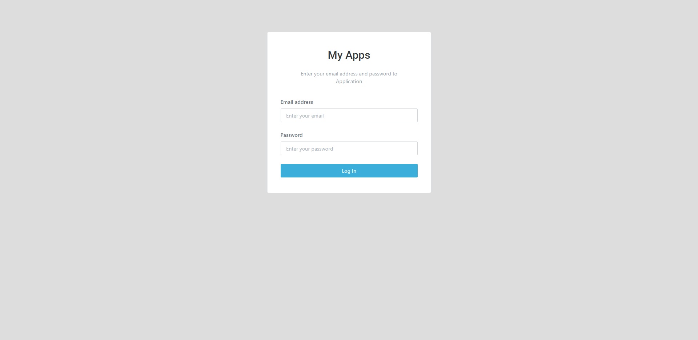
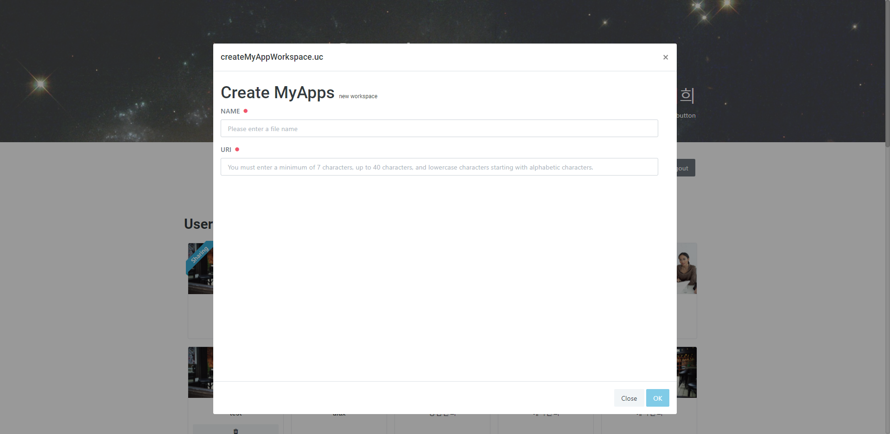

# 시작 화면

## 시작화면

### 시작 화면 구성

`New App` 버튼으로 새 앱을 만들 수 있습니다.

`logout` 버튼으로 로그아웃 합니다.

**User Apps List**에서 내 앱이나 공유받은 앱을 관리할 수 있습니다.

### 새 앱 생성하기

#### 1. 로그인

**MyApps 홈페이지 (**[https://myapps.appspeed.net](https://myapps.appspeed.net)**) 에 접속하여 로그인합니다**

####

#### 2. 앱 생성

`New App` 버튼을 클릭해서 새 앱을 생성합니다.

.png>)

앱의 이름과 **URI**를 작성한 후 `OK` 버튼을 눌러 생성을 완료합니다.

생성 완료 후에는 **User Apps List** 목록에서 앱을 선택하여 들어갈 수 있습니다.
