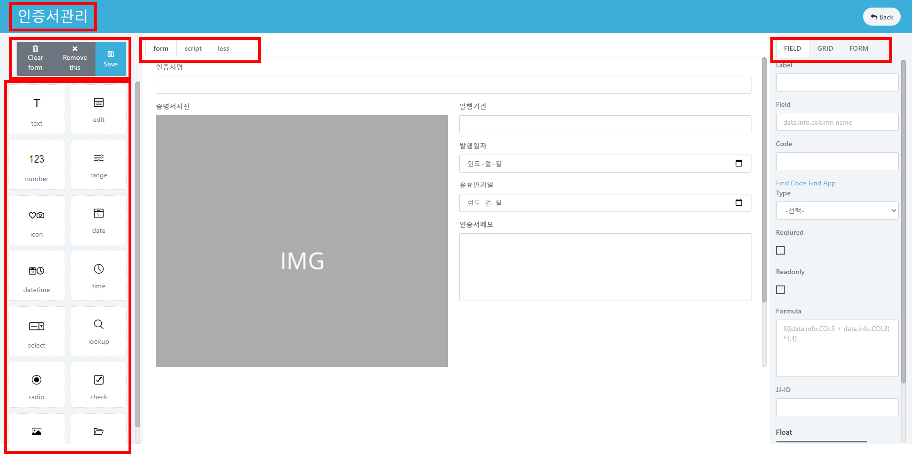

# 새 폼 생성하기

## 새 폼 생성하기

**MyApps New Form 생성 동영상** \
&#x20;

**Type**에서 `New Form` 버튼을 클릭하면 새 폼을 구성하는 화면으로 넘어갑니다. \

좌측에서 원하는 요소를 선택하여 **form** 화면으로 드래그 합니다. **label** 및 **domain**을 설정합니다.

> 요소를 선택하여 사이즈를 조절할 수 있습니다.

| element    |         Explanation        |
| ---------- | :------------------------: |
| `text`     |      text를 입력할 수 있는 폼      |
| `edit`     |      긴 텍스트를 입력할 수 있는 폼     |
| `number`   |       숫자를 입력할 수 있는 폼       |
| `range`    |       수치를 입력할 수 있는 폼       |
| `icon`     |       아이콘을 선택할 수 있는 폼      |
| `date`     |       날짜를 입력할 수 있는 폼       |
| `datetime` |     날짜와 시간을 입력할 수 있는 폼     |
| `time`     |       시간을 입력할 수 있는 폼       |
| `select`   |       선택지를 입력할 수 있는 폼      |
| `applink`  | 다른 폼의 필드에서 선택지를 가져올 수 있는 폼 |
| `popup`    |   다른 폼에서 선택지를 가져올 수 있는 폼   |
| `radio`    |  radio 형식의 선택지를 만들 수 있는 폼  |
| `check`    |   체크박스 형식의 선택지를 만들 수 있는 폼  |
| `image`    |       이미지를 넣을 수 있는 폼       |
| `file`     |       파일을 업로드할 수 있는 폼      |

> **`select`요소는 우측 FIELD 메뉴의 code에서 설정이 가능합니다.**

**원하지 않는 요소는 상단의 `Delete` 를 눌러 삭제할 수 있습니다.**\
개발자의 경우, 더 많은 설정을 원한다면 **script**, **less**화면에서 입력할 수 있습니다.

우측의 **FIELD** 메뉴에서 선택한 요소를 원하는 대로 설정할 수 있습니다.

우측의 **GRID** 메뉴에서 원하지 않는 필드를 숨기고 필드 순서를 변경할 수 있습니다.

우측의 **FORM** 메뉴에서 현재 폼 설정을 변경할 수 있습니다.

> **폼 작성을 완료했다면 우측 상단의 `저장` 버튼을 클릭합니다.**\
> **우측 상단의 `Back` 버튼을 통해 내 앱 화면으로 돌아갈 수 있습니다.**
