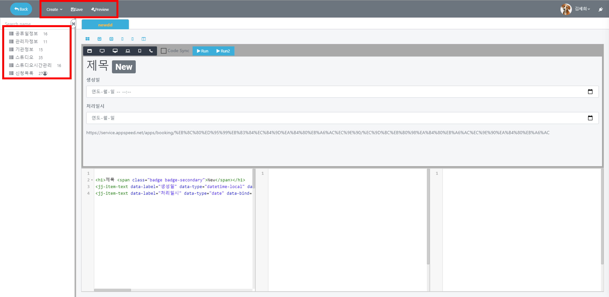
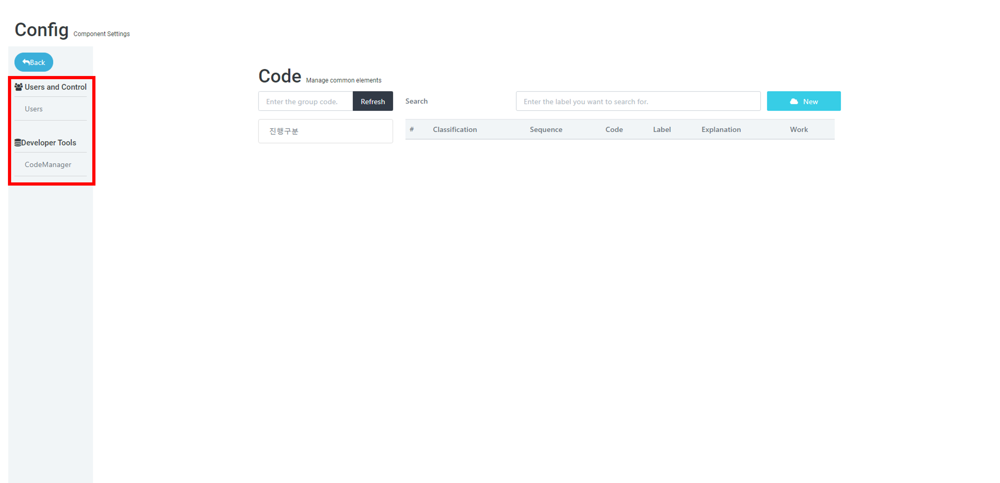

# IDE

## IDE

### 개발자를 위한 통합 개발 환경입니다.

**앱의 페이지를 관리, 개발할 수 있습니다.**

`Create` 버튼으로 **새 페이지**와 **폴더**를 만들 수 있습니다.

`Save` 버튼으로 설정한 내용을 **저장**할 수 있습니다.

`시험` 버튼으로 만들어진 페이지를 **테스트**해볼 수 있습니다.

좌측 목록에서 페이지나 폴더를 _우클릭_하여 **이름 변경**, **삭제** 등을 진행할 수 있습니다.

**구성 요소 설정을 관리하는 화면입니다.**\
\

| menu                        | Explanation         |
| --------------------------- | ------------------- |
| `Users and Control - Users` | 앱을 공유할 사람들을 관리하는 메뉴 |

> 사용자를 **검색하여 추가** 가능하며 **Reader**, **Editor**, **Developer** 세 가지 방법으로 앱을 공유할 수 있습니다.

| menu                                 | Explanation |
| ------------------------------------ | ----------- |
| `Data administration - Localization` | 위치를 설정하는 메뉴 |

| menu                             | Explanation     |
| -------------------------------- | --------------- |
| `Developer Tools - Code Manager` | 그룹별 코드를 관리하는 메뉴 |

> **그룹 ID를 지정해** 그룹별로 코드를 생성할 수 있습니다.
