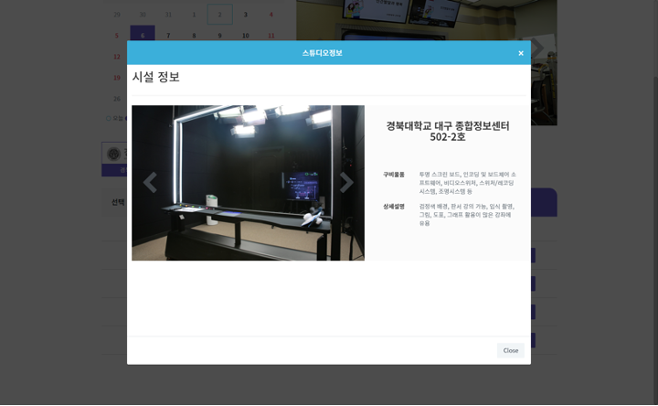
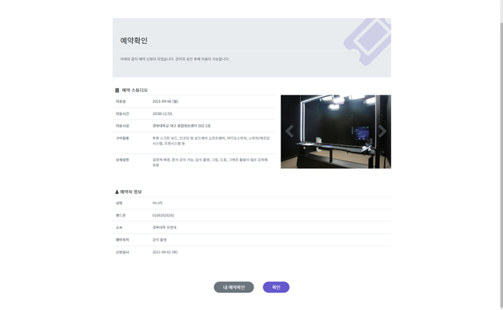

# 화면 구성

### 대구·경북 권역 대학원격교육지원센터 스튜디오 예약 신청 홈페이지입니다.

#### ([https://dgstudio.udec.kr/apps/booking2](https://dgstudio.udec.kr/apps/booking2))  스튜디오 예약 현황을 확인하고, 예약 신청을 할 수 있습니다.

## 화면 구성

.png>)


**달력 부분**: 조회하고 싶은 예약 일자를 선택할 수 있습니다.&#x20;

> 상단의 `<`와 `>` 버튼을 클릭하면 이전이나 이후 달력으로 이동할 수 있습니다.

**대학 선택 부분**: 조회하고 싶은 예약 일자를 선택하면 대학을 선택할 수 있습니다.&#x20;

> 해당 대학의 공지사항이 있을 시, 대학 로고를 선택하면 공지사항 창이 팝업 될 수 있습니다. 공지사항을 확인 후, 해당 공지사항 창을 닫고 예약을 진행해 주시면 됩니다.

**스튜디오 목록 부분**:  조회하고 싶은 예약 일자 대학의 스튜디오별 예약 현황을 확인할 수 있습니다.

**상단 `내 예약 확인` 버튼**: 신청한 예약 내역을 조회해볼 수 있습니다.

**상단 `관리자 페이지`버튼**: 스튜디오 예약 관리자 페이지로 넘어갈 수 있습니다.


### 스튜디오 목록 부분 내의 스튜디오명 클릭 화면

스튜디오 목록 부분에서 원하는 스튜디오명을 클릭하면 시설 정보를 확인할 수 있습니다.

### 예약 신청 화면

**선택한 예약 신청 날짜, 시간, 스튜디오 시설 정보**를 확인할 수 있습니다. 이후 성명, 핸드폰 번호, 소속, 예약 목적을 기재하고 유의 사항과 정보 제공 동의에 모두 동의한 후 `예약신청` 버튼을 누르면 신청이 완료되며 신청한 내용은 바로 내 예약 확인에서 찾아볼 수 있습니다.

### 예약 확인 화면

예약 신청을 완료한 후 방금 신청한 확정 내용을 확인할 수 있습니다.

### 내 예약 확인 화면

신청할 때 작성했던 예약자명과 연락처로 조회하여 내가 신청한 예약 목록을 조회하고 승인 여부를 확인할 수 있습니다.

