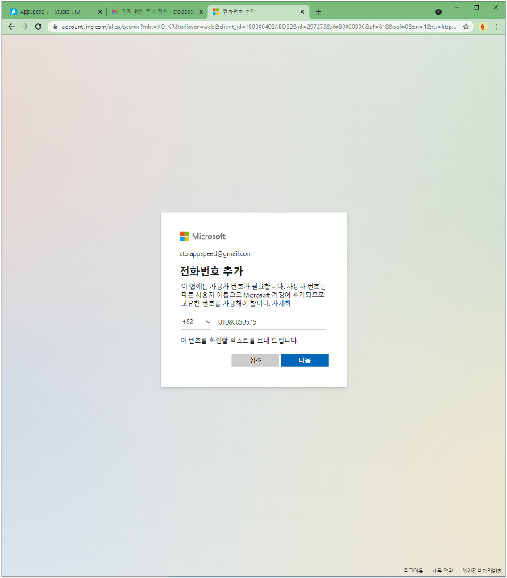
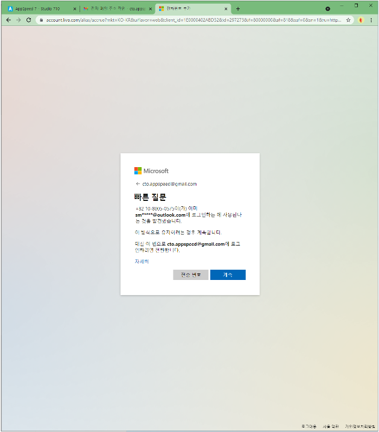
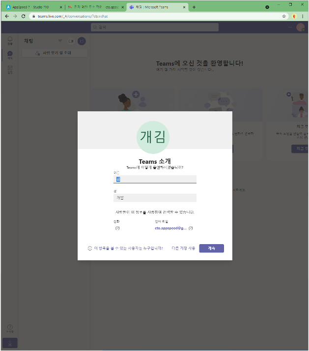
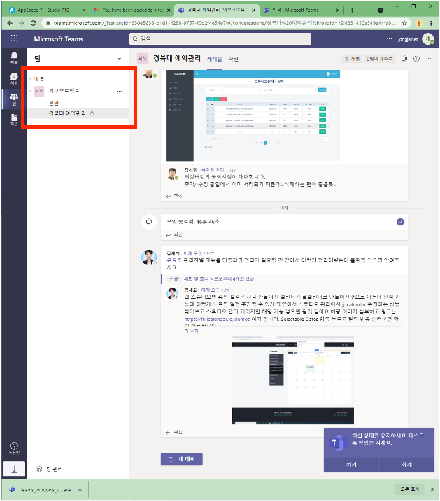

# Teams 가입하기

#### microsoft 계정을 만들었다면, Teams.microsoft.com으로 이동해 줍니다.

#### 

#### 아래의 이미지대로 팀스에 방금 만든 microsoft 계정을 이용하여 가입해 줍니다.

#### 

#### 

#### 

#### 가입했으면 팀스의 프로필 설정합니다.

#### 프로필을 설정하고 보면 아래처럼 아직 팀스에 채널이 추가가 안된 것을 볼 수 있습니다.

#### 

#### 자신의 받은 메일함으로 가서 팀스의 초대메일의 `Open Microsoft Teams` 를 눌러 줍니다

#### 

#### 초대메일을 수락하면 아래의 화면처럼 팀에 채널이 추가된 것을 볼 수 있습니다.

